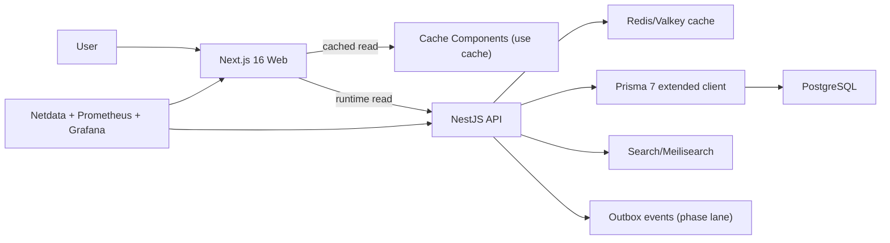

# DESIGN_OVERVIEW

Tài liệu tóm tắt kiến trúc để đọc nhanh thay cho việc mở nhiều file dài trong `design/`.

## 1. Runtime topology (2026)

- `apps/web` (Next.js 16) phục vụ App Router + cache components.
- `apps/api` (NestJS 11 + Prisma 7) là backend authority.
- `apps/admin` là admin SPA.
- `infra/docker/compose.prod.yml` là source triển khai self-host.

## 2. Ownership boundaries

- `wisdom-qa`: source-backed tri thức và rule-pack canonical.
- `calendar`: compose advisory/read-model theo ngày.
- `content`: guide/preset phục vụ hiển thị và thực hành.
- `engagement`: chỉ self-state của người dùng.

## 3. Performance baseline

- Next.js: `cacheComponents`, `use cache`, `cacheLife`, `cacheTag`.
- API: Redis/Valkey cache cho read-heavy endpoint; Prisma extended client cho slow-query visibility.
- Monorepo: Turborepo remote cache (`TURBO_TOKEN`, `TURBO_TEAM`, `TURBO_API`).
- CI: Woodpecker chạy `turbo run` theo pipeline cache-aware.
- Deploy: Docker multi-stage + non-root runtime.

## 4. 2026 critical paths

## 5. Docs map

- Full canon: `design/README.md`
- VPS ops: `design/02-platform-baseline/vps-runtime/`
- Execution overlay: `design/04-execution-overlay/`
- Monitoring: `design/02-platform-baseline/vps-runtime/MONITORING_SELF_HOST.md`

## 6. Change policy

- Không sửa logic domain khi tối ưu hạ tầng/performance.
- Mọi thay đổi runtime phải giữ boundary module theo `AGENTS.md`.
