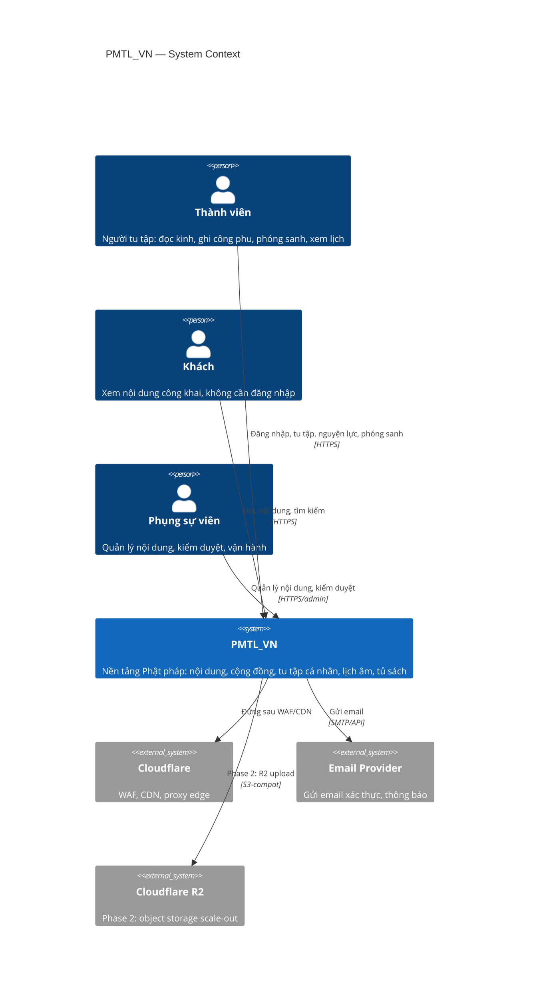
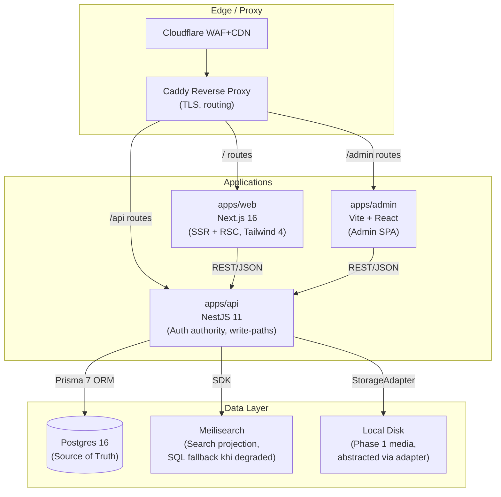

# Architecture At A Glance

File này là bản tóm tắt một trang cho người mới vào `design/`.
Nó không override root docs. Nó chỉ gom các quyết định đủ quan trọng để tránh đọc lệch phase.

> **Canonical decisions**: `design/01-repo-constitution/DECISIONS.md`
> **Implementation truth**: `design/04-execution-overlay/repo/IMPLEMENTATION_MAPPING.md`
> **Root ownership**: `../ROOT_DOC_OWNERSHIP.md`

---

## C4 Level 1 — System Context

---

## C4 Level 2 — Container View (Phase 1)

---

## Current direction

- Product direction: `design-first rebuild`
- Runtime target:
  - `apps/web` — Next.js 16
  - `apps/api` — NestJS backend authority
  - `apps/admin` — Vite + React admin
- Source of truth:
  - `Postgres` for business data
  - `apps/api` for auth, write-paths, orchestration

---

## Phase 1 baseline

- Full Phase 1 list lives in [DECISIONS.md](../01-repo-constitution/DECISIONS.md) section 2.
- Shorthand only: first launch = `apps/web + apps/api + apps/admin` trên `Postgres + Caddy` với storage abstraction, auth/upload hardening, `audit_logs`, `feature_flags`, app-layer rate limit, `/health/*`, `/metrics`, và restore discipline.

---

## Deferred until measured pain

- Full deferred / excluded matrix lives in [DECISIONS.md](../01-repo-constitution/DECISIONS.md) sections 3 and 15, plus [PHASE_ACTIVATION_MATRIX.md](../01-repo-constitution/PHASE_ACTIVATION_MATRIX.md).
- Default reading shortcut: optional-scale tech như `Valkey`, `BullMQ`, `Meilisearch`, `PgBouncer`, Prometheus/Grafana/Alertmanager, và tracing không được scaffold sớm nếu chưa có trigger đo được.

---

## Explicit exclusion

- `pgvector`

Không được coi `pgvector` là deferred thông thường. Chỉ xem xét lại khi trigger ở `design/02-platform-baseline/optional-scale/PGVECTOR_DECISION.md` được đáp ứng.

---

## Readiness semantics

| Label | Meaning | Owner doc |
|---|---|---|
| `design-ready` | design đủ rõ để bắt đầu implementation planning | `design/00-governance/STATUS_AND_PHASE.md` |
| `implementation-ready` | artifact runtime cụ thể đã được map đủ để bắt đầu code module đó | `design/04-execution-overlay/repo/IMPLEMENTATION_MAPPING.md` |
| `launch-ready` | launch blockers thật đã pass, gồm runtime evidence như restore drill | `design/04-execution-overlay/repo/IMPLEMENTATION_MAPPING.md` |

**Rule**: không dùng `design-ready` để ám chỉ runtime đã tồn tại.

---

## Search and async contract

- Phase 1:
  - search mặc định là `Postgres-first`
  - side effects quan trọng dùng sync hoặc fire-and-forget có log intent + log outcome + recovery path rõ
- Phase 2+:
  - nếu trigger đủ mạnh, search chuyển sang `Meilisearch`
  - nếu async reliability đủ đau, bật `outbox_events -> dispatcher -> queue -> worker`

**Không được** đọc doc Phase 2+ rồi suy ra Phase 1 đã mặc định queue/outbox-driven.

---

## Known operational risk

- Điểm yếu lớn nhất của Phase 1 là `local disk media`
- Các failure mode đã biết:
  - disk đầy
  - volume mount sai
  - DB/file drift sau restore

Muốn gọi là production-safe thì restore drill phải pass, không chỉ có docs.
