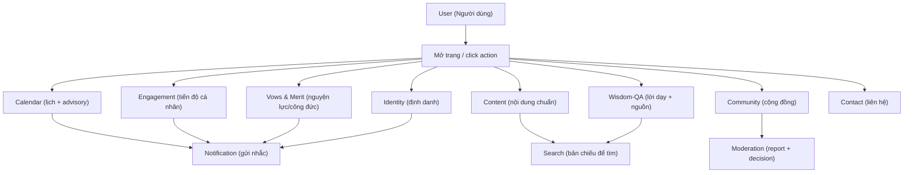

# System Data Flow Map (Bản đồ luồng dữ liệu toàn hệ)

File này là bản đồ vận hành nhìn nhanh của cả hệ thống PMTL_VN.

Nó trả lời thật cụ thể 5 câu:

1. user mở trang nào
2. request đi vào module nào
3. module nào chỉ đọc `read-only (chỉ đọc)`
4. module nào mới được ghi `canonical write-path (đường ghi chuẩn gốc)`
5. lúc nào sinh `side effect (tác dụng phụ)` như:
   - gửi push/email
   - đồng bộ tìm kiếm
   - revalidate cache
   - phát event qua `outbox_events`

> Đây là `overview doc (tài liệu định hướng đọc)`, không thay `module-map.md`, `contracts.md`, [PAGE_INVENTORY.md](../04-execution-overlay/web/PAGE_INVENTORY.md), hay [API_ROUTE_INVENTORY.md](../04-execution-overlay/api/API_ROUTE_INVENTORY.md).
> Nếu file này khác owner docs, owner docs thắng.

## Cách hiểu cực ngắn

Hệ này có 3 lớp:

1. `Surface layer (lớp màn hình)`:
   - web
   - admin
   - mobile/PWA sau này
2. `Owner modules (mô-đun sở hữu dữ liệu gốc)`:
   - 11 module business/domain
3. `Platform modules (mô-đun nền tảng/cắt ngang)`:
   - sessions
   - audit
   - feature flags
   - rate limit
   - storage
   - health
   - metrics
   - outbox/queue/worker khi phase 2+ bật

## Luật vàng của toàn hệ

- Mỗi loại dữ liệu gốc chỉ có **một chủ sở hữu thật**.
- Module khác có thể:
  - đọc
  - tham chiếu bằng `id/ref`
  - nhận dữ liệu đã ghép sẵn để hiển thị
- Module khác **không được**:
  - tự giữ một bản gốc song song
  - tự sửa dữ liệu gốc của module kia
  - tự suy luận rồi ghi ngược nếu owner chưa cho phép

Ví dụ:
- bài `Kinh Bài Tập` là của `Content`
- sheet công phu hôm nay của user là của `Engagement`
- hai cái này liên quan nhau, nhưng không được nhập thành một bảng

## Từ điển rất ngắn để đọc file này

- `Read (đọc)`: lấy dữ liệu để hiển thị hoặc quyết định bước tiếp
- `Write (ghi)`: ghi vào nơi giữ dữ liệu gốc
- `Derived (dữ liệu tính ra)`: dữ liệu ghép từ nhiều chỗ để hiển thị, không phải dữ liệu gốc
- `Side effect (tác dụng phụ)`: việc đi sau ghi chính, có thể chậm hơn hoặc chạy nền
- `Projection (bản chiếu)`: bản phục vụ tra cứu/hiển thị, không phải nguồn chuẩn gốc

## Nhìn toàn hệ như ngoài đời

| Module | Vai ngoài đời | Giữ dữ liệu gì | Không giữ dữ liệu gì |
|---|---|---|---|
| `01-Identity` | Phòng hộ khẩu + cổng ra vào | `users`, `sessions`, role, block state, provider linkage | bài viết, progress tu tập |
| `02-Content` | Thư viện + kho tài liệu chuẩn | `posts`, `hubPages`, `beginnerGuides`, `downloads`, `chantItems`, `chantPlans`, `sutras`, `sutraVolumes`, `sutraChapters`, `sutraGlossary`, `mediaCollections` | bookmark, reading progress, practice sheet |
| `03-Community` | Sân sinh hoạt cộng đồng | `communityPosts`, `communityComments`, `postComments`, `guestbookEntries` | report lifecycle chuẩn gốc |
| `04-Engagement` | Sổ tay cá nhân | `sutraBookmarks`, `sutraReadingProgress`, `chantPreferences`, `practiceLogs`, `practiceSheets`, `ngoiNhaNhoSheets` | kinh/chú/guide chuẩn |
| `05-Moderation` | Ban kiểm luật | `moderationReports`, decision history, audit trail kiểm duyệt | bài/comment gốc |
| `06-Search` | Bàn tra cứu thư mục | query contract, search index, search status | dữ liệu gốc của content/wisdom |
| `07-Calendar` | Ban lịch tu học | `events`, `eventAgendaItems`, `eventSpeakers`, `eventCtas`, `lunarEvents`, `lunarEventOverrides`, `personalPracticeCalendarReadModel` | kinh văn gốc, source teaching text gốc |
| `08-Notification` | Phòng phát loa/gửi nhắc | `pushSubscriptions`, `pushJobs`, reminder preferences | inbox chuẩn gốc, ngày đặc biệt gốc |
| `09-Vows & Merit` | Sổ phát nguyện, hoàn nguyện, phóng sanh | `vows`, `vowProgressEntries`, `lifeReleaseJournal` | ritual truth gốc |
| `10-Wisdom-QA` | Kho tư liệu chính thống | `wisdomEntries`, `qaEntries`, `authorityProfiles`, audiobook metadata, offline bundle metadata, source provenance | hub page nhập môn chung |
| `11-Contact` | Bảng liên hệ | `contactInfo`, `volunteers` | form ticket/community/profile user |

## Platform / control-plane tables mà người mới rất hay quên

Các bảng này **không nên bị nuốt vào nhầm business module**. Chúng thuộc lớp `platform/control-plane (nền tảng/điều phối)` ở [platform-modules.md](../02-platform-baseline/api-runtime/PLATFORM_MODULES.md).
Phần dưới đây là `orientation snapshot (ảnh chụp định hướng)` để dễ đọc toàn hệ; owner thật của boundary/control-plane vẫn là [platform-modules.md](../02-platform-baseline/api-runtime/PLATFORM_MODULES.md).

| Bảng / vùng dữ liệu | Owner thực tế | Dùng để làm gì |
|---|---|---|
| `sessions` | `platform/sessions` + `Identity` flow dùng tới | giữ vòng đời phiên đăng nhập |
| `audit_logs` | `platform/audit` | ghi nhật ký hành động quan trọng |
| `feature_flags` | `platform/feature-flags` | bật/tắt tính năng theo phase |
| `rate_limit_records` | `platform/rate-limit` | giới hạn tần suất theo IP/user |
| `media_assets` | `platform/storage` | metadata file upload, không phải content guide |
| `outbox_events` | `platform/outbox` khi phase 2+ bật | handoff side effect quan trọng sang xử lý nền |
| queue jobs | `platform/queue` | xử lý nền theo hàng đợi |
| worker status / heartbeat | `platform/worker-runtime` | biết worker còn sống hay chết |

Điểm quan trọng:
- `feature_flags`, `rate_limit_records`, `outbox_events`, `media_assets` **không** phải data business của `Identity`
- nhưng `Identity`, `Content`, `Community`, `Notification` đều có thể dùng các platform module đó

## Bảng dữ liệu thật theo từng module

### `01-Identity`

Giữ thật:
- `users`
- `sessions`
- provider linkage fields như `google_sub`
- role / block state

Đọc thêm khi cần:
- `media_assets` để lấy avatar ref
- `feature_flags` để bật/tắt flow
- `rate_limit_records` để chống abuse

Không được tự giữ:
- community profile riêng
- notification recipient cache kiểu source of truth

### `02-Content`

Giữ thật:
- `posts`
- `hubPages`
- `beginnerGuides`
- `downloads`
- `chantItems`
- `chantPlans`
- `sutras`
- `sutraVolumes`
- `sutraChapters`
- `sutraGlossary`
- `categories`
- `tags`
- `mediaCollections`

Đọc thêm khi cần:
- author/admin ref từ `Identity`
- `media_assets` từ storage layer
- `relatedEvent` ref từ `Calendar`

Không được tự giữ:
- `sutraBookmarks`
- `sutraReadingProgress`
- `practiceSheets`
- `ngoiNhaNhoSheets`

### `03-Community`

Giữ thật:
- `communityPosts`
- `communityComments`
- `postComments`
- `guestbookEntries`

Đọc thêm khi cần:
- user ref từ `Identity`
- post ref từ `Content`

Không được tự giữ:
- `moderationReports`
- moderation decision lifecycle

### `04-Engagement`

Giữ thật:
- `sutraBookmarks`
- `sutraReadingProgress`
- `chantPreferences`
- `practiceLogs`
- `practiceSheets`
- `ngoiNhaNhoSheets`

Đọc thêm khi cần:
- `sutras`, `chantItems`, `chantPlans` từ `Content`
- advisory/context ref từ `Calendar`

Không được tự giữ:
- bài kinh gốc
- guide gốc
- FAQ gốc

### `05-Moderation`

Giữ thật:
- `moderationReports`

Đọc thêm khi cần:
- target entity từ `Community`
- actor/ref từ `Identity`

Có thể sync ra target:
- `reportCount`
- `lastReportReason`
- `moderationStatus`
- `approvalStatus`
- `isHidden`

Nhưng:
- những field này **không phải** source of truth

### `06-Search`

Giữ thật:
- search query contract
- search document/index
- search status/freshness

Đọc thêm khi cần:
- source fields từ `Content`
- source fields từ `Wisdom-QA`
- moderation-aware visibility từ owner module

Không được tự giữ:
- publish status chuẩn gốc
- moderation status chuẩn gốc

### `07-Calendar`

Giữ thật:
- `events`
- `eventAgendaItems`
- `eventSpeakers`
- `eventCtas`
- `lunarEvents`
- `lunarEventOverrides`
- `personalPracticeCalendarReadModel`

Đọc thêm khi cần:
- content refs
- context từ `Engagement`
- vow/life-release hooks từ `Vows & Merit`
- teaching refs từ `Wisdom-QA`

Không được tự giữ:
- full discourse text
- ritual truth gốc

### `08-Notification`

Giữ thật:
- `pushSubscriptions`
- `pushJobs`
- preferences/reminders projection

Đọc thêm khi cần:
- user target từ `Identity`
- event/advisory package từ `Calendar`
- context từ `Content` / `Community` / `Moderation`

Không được tự giữ:
- inbox canonical
- source data của event/bài viết/report

### `09-Vows & Merit`

Giữ thật:
- `vows`
- `vowProgressEntries`
- `lifeReleaseJournal`

Đọc thêm khi cần:
- guide ref từ `Content`
- advisory/time suitability từ `Calendar`

Không được tự giữ:
- guide chuẩn
- ritual script chuẩn

### `10-Wisdom-QA`

Giữ thật:
- `wisdomEntries`
- `qaEntries`
- `authorityProfiles`
- audiobook metadata
- offline bundle metadata
- source provenance

Đọc thêm khi cần:
- hub/gateway link từ `Content`
- search indexing downstream

Không được tự giữ:
- beginner guides chuẩn
- hub page chuẩn

### `11-Contact`

Giữ thật:
- `contactInfo`
- `volunteers`

Không được tự giữ:
- form submissions
- community profile
- auth user store

## Permission matrix shortcut (bản rút gọn quyền)

File gốc: [PERMISSION_MATRIX.md](../03-domains/identity/REFERENCES/PERMISSION_MATRIX.md)

| Vai trò | Đọc public content | Ghi self-state | Đăng community | Xử lý moderation | Quản lý content/admin ops |
|---|---|---|---|---|---|
| `guest (khách)` | được | không | thường không | không | không |
| `member (thành viên)` | được | được trên dữ liệu của mình | được nếu flow cho phép | không | không |
| `admin (phụng sự viên quản trị)` | được | chỉ hỗ trợ khi có flow canon, không có quyền bừa | có thể quản lý ở phạm vi admin | được theo lane moderation/admin | được trong workspace được cấp |
| `super-admin` | được | chỉ dùng khi thật sự cần support sâu | được | được đầy đủ | được đầy đủ |

Điểm mới phải nhớ:
- module self-owned như `Engagement` mặc định là `deny-by-default (mặc định từ chối)` cho cross-user write
- nếu chưa có assisted-entry/support lane canon thì admin cũng không được sửa hộ

## Outbox event taxonomy shortcut (bản rút gọn side effect quan trọng)

File gốc: [outbox-event-taxonomy.md](../04-execution-overlay/cross-module/OUTBOX_EVENT_TAXONOMY.md)

Khi nào cần `outbox_events`:
- publish/unpublish/delete content mà downstream phải reindex/revalidate
- moderation decision quan trọng cần notify
- calendar advisory/event change cần nhắc downstream
- wisdom publish cần search sync hoặc rebuild bundle

Ví dụ event:
- `content.post.published`
- `content.post.unpublished`
- `content.post.deleted`
- `content.chant_item.published`
- `wisdom.entry.published`

Hiểu rất đời thường:
- ghi chính xong rồi mới phát “phiếu việc” cho thằng chạy nền làm tiếp
- phiếu đó chính là `outbox event`

## Notification / Web Push / VAPID hiểu rất đời thường

File gốc: [push-notification-architecture.md](../02-platform-baseline/optional-scale/PUSH_NOTIFICATION_ARCHITECTURE.md)

3 lớp chính:

1. `pushSubscriptions (danh sách thiết bị đã đăng ký nhận push)`
2. `pushJobs (công việc gửi push)`
3. `VAPID/Web Push delivery (cơ chế gửi thông báo chuẩn web)`

Luồng:
- trình duyệt cho phép nhận push
- app tạo/cập nhật `pushSubscription`
- khi có việc cần nhắc, hệ tạo `pushJob`
- worker/delivery lane dùng `VAPID` để gửi

Điểm quan trọng:
- `pushSubscriptions` là “địa chỉ gửi”
- `pushJobs` là “phiếu công việc gửi”
- không cái nào là “hộp thư chuẩn gốc của user”

## Search phase 1 vs phase 2, đừng lẫn

### Phase 1

- đường đọc chính: `SQL/API fallback`
- chưa cần worker nặng
- search vẫn chỉ là projection
- phù hợp khi scope search còn vừa

### Phase 2+

- bật `Meilisearch`
- có `outbox_events`
- có dispatcher
- có queue/worker nếu cần
- index sync rõ ràng hơn, recovery/reindex rõ hơn

Điểm cực quan trọng:
- phase 1 hay phase 2 thì `Search` vẫn **không** là nguồn dữ liệu gốc

## Hành trình người dùng và luồng dữ liệu thực tế

### 1. Đăng nhập rồi vào dashboard

Trang user mở:
- `/dang-nhap`
- rồi vào dashboard

| Bước | Đọc ở đâu | Ghi ở đâu | Side effect |
|---|---|---|---|
| user gửi form đăng nhập | `Identity` kiểm tra user/session | `Identity` tạo session | có thể gửi security event |
| dashboard bootstrap | `Identity`, `Calendar`, `Engagement`, `Notification` | không ghi nếu chỉ mở xem | không |

Hình dung:
- `Identity` là nơi duy nhất nói “anh này là ai”

### 2. Đọc bài viết hoặc guide

Trang user mở:
- bài viết
- guide
- download hub

| Bước | Đọc ở đâu | Ghi ở đâu | Side effect |
|---|---|---|---|
| mở bài viết | `Content` | không | có thể tăng view counter nếu flow có |
| admin publish bài | `Content` đọc draft/state | `Content` ghi publish state | revalidate, reindex, optional notify |

### 3. Sutra Reading (đọc kinh, bookmark, progress)

Trang user mở:
- trang kinh
- chương kinh
- bookmark/progress panel

| Bước | Đọc ở đâu | Ghi ở đâu | Side effect |
|---|---|---|---|
| mở cây kinh | `Content` đọc `sutras`, `sutraVolumes`, `sutraChapters` | không | không |
| lưu bookmark | `Content` để biết chapter nào, `Identity` để biết user nào | `Engagement` ghi `sutraBookmarks` | rất ít |
| lưu vị trí đọc gần nhất | `Content` đọc chapter ref | `Engagement` ghi `sutraReadingProgress` | rất ít |

Hình dung:
- thư viện giữ cuốn kinh
- `Engagement` giữ tờ giấy đánh dấu chỗ anh đang đọc

### 4. Daily Practice Sheet

Trang user mở:
- `Kinh Bài Tập`
- bảng công phu hôm nay

| Bước | Đọc ở đâu | Ghi ở đâu | Side effect |
|---|---|---|---|
| mở guide | `Content` | không | không |
| bấm bắt đầu / lưu sheet | có thể đọc context ref từ `Content` | `Engagement` ghi `practiceSheets` | reminder downstream nếu bật |
| đánh dấu hoàn thành | `Engagement` | `Engagement` | optional reminder summary |

### 5. Ngôi Nhà Nhỏ tracker

Trang user mở:
- hub `Ngôi Nhà Nhỏ`
- FAQ
- tracker cá nhân

| Bước | Đọc ở đâu | Ghi ở đâu | Side effect |
|---|---|---|---|
| đọc guide/FAQ | `Content` | không | không |
| tạo sheet mới | có thể đọc preset/context từ `Content` | `Engagement` ghi `ngoiNhaNhoSheets` | không đáng kể |
| cập nhật entry | `Engagement` | `Engagement` | reminder nếu có |
| mark `self_stored` / `offered` | `Engagement` | `Engagement` | có thể ảnh hưởng reminder logic |

### 6. Community Post

Trang user mở:
- danh sách bài cộng đồng
- tạo bài
- detail bài

| Bước | Đọc ở đâu | Ghi ở đâu | Side effect |
|---|---|---|---|
| xem feed community | `Community` | không | không |
| tạo bài mới | `Identity` để biết actor | `Community` ghi `communityPosts` | alert admin nếu policy cần |
| bình luận | `Community` + ref sang `Content` nếu là post comment | `Community` ghi `communityComments`/`postComments` | notify/admin alert |

### 7. Community post bị report

Trang user/admin mở:
- detail bài/comment
- moderation workspace

| Bước | Đọc ở đâu | Ghi ở đâu | Side effect |
|---|---|---|---|
| user bấm report | `Community` để biết target | `Moderation` ghi `moderationReports` | alert admin |
| admin quyết định | `Moderation` đọc report | `Moderation` ghi decision | sync summary, notify user, deindex nếu hidden |

### 8. Search Module — phase 1 vs phase 2

Trang user/admin mở:
- `/tim-kiem`
- admin search status

| Tình huống | Đọc ở đâu | Ghi ở đâu | Side effect |
|---|---|---|---|
| user search phase 1 | `Search` nhưng path thật là SQL/API fallback | không | không |
| user search phase 2 | `Search` index (`Meilisearch`) | không | không |
| admin reindex | `Content`/`Wisdom-QA` source fields | `Search` index/status | worker/job/recovery |

### 9. Calendar + daily advisory + pre-notify

Trang user/admin mở:
- lịch sự kiện
- lịch tu học cá nhân
- admin advisory preview

| Bước | Đọc ở đâu | Ghi ở đâu | Side effect |
|---|---|---|---|
| build lịch cá nhân | `Calendar` + refs từ `Content` + context từ `Engagement`/`Vows & Merit` + source ref từ `Wisdom-QA` | `Calendar` ghi/refresh read model nếu materialized | downstream reminder candidates |
| admin preview advisory | `Calendar` | không ghi canonical | không |
| pre-notify | `Calendar` output được `Notification` đọc | `Notification` ghi `pushJobs` | push dispatch |

### 10. Offline Bundle Download

Trang user mở:
- trang `Bạch thoại`
- trang tải ngoại tuyến

| Bước | Đọc ở đâu | Ghi ở đâu | Side effect |
|---|---|---|---|
| xem danh sách bundle | `Wisdom-QA` đọc offline bundle metadata | không | không |
| tải bundle | `Wisdom-QA`/delivery path | không ghi canonical business data | có thể log download |
| admin rebuild bundle | `Wisdom-QA` đọc source entries | `Wisdom-QA` cập nhật bundle metadata | search/bundle refresh |

### 11. Phát nguyện + nhật ký phóng sanh

Trang user/admin mở:
- tạo vow
- nhật ký phóng sanh
- assisted-entry

| Bước | Đọc ở đâu | Ghi ở đâu | Side effect |
|---|---|---|---|
| tạo vow | `Identity` để biết owner | `Vows & Merit` ghi `vows` | reminder signal nếu cần |
| thêm milestone/progress | `Vows & Merit` | `Vows & Merit` | recompute summary |
| tạo journal phóng sanh | `Content` đọc guide ref nếu có | `Vows & Merit` ghi `lifeReleaseJournal` | reminder candidates |
| assisted-entry | `Identity` + assisted-entry rules | `Vows & Merit` | audit bắt buộc |

### 12. Notification settings và push delivery

Trang user/admin mở:
- trang thông báo của tôi
- admin notification ops

| Bước | Đọc ở đâu | Ghi ở đâu | Side effect |
|---|---|---|---|
| user xem preferences | `Notification` | không | không |
| user subscribe push | browser + `Notification` | `Notification` ghi `pushSubscriptions` | không |
| hệ tạo job gửi | `Notification` đọc context từ module khác | `Notification` ghi `pushJobs` | worker gửi push/email |

### 13. Trang liên hệ

Trang user/admin mở:
- trang liên hệ
- admin quản lý PSV

| Bước | Đọc ở đâu | Ghi ở đâu | Side effect |
|---|---|---|---|
| user mở trang liên hệ | `Contact` đọc `contactInfo`, `volunteers` | không | không |
| admin sửa thông tin | `Contact` | `Contact` | gần như không |

## Những chỗ rất dễ code sai

### Sai kiểu 1: lưu progress vào `Content`

Sai vì:
- `Content` giữ dữ liệu chuẩn
- progress của user là `Engagement`

### Sai kiểu 2: để `Community` tự giữ full report lifecycle

Sai vì:
- report lifecycle chuẩn gốc là `Moderation`

### Sai kiểu 3: lấy `Search` làm dữ liệu thật

Sai vì:
- `Search` chỉ là projection
- source thật vẫn ở `Content` hoặc `Wisdom-QA`

### Sai kiểu 4: để `Calendar` chép nguyên kinh văn gốc vào advisory

Sai vì:
- `Calendar` chỉ compose
- text gốc và provenance thuộc `Wisdom-QA`

### Sai kiểu 5: coi `pushJobs` là inbox chuẩn gốc

Sai vì:
- `pushJobs` chỉ là công việc gửi
- không phải hộp thư chuẩn gốc của user

### Sai kiểu 6: admin tự sửa dữ liệu cá nhân của member không qua support lane

Sai vì:
- `Engagement` và `Vows & Merit` là self-owned
- cross-user write mặc định phải bị chặn nếu chưa có lane canon

## Sơ đồ tổng hợp nhìn một phát là hiểu

## Câu chốt cuối cùng

- `Identity` trả lời: **anh là ai**
- `Content` trả lời: **nội dung chuẩn là gì**
- `Community` trả lời: **mọi người đang đăng và bình luận gì**
- `Engagement` trả lời: **riêng tôi đã đọc tới đâu, đã làm tới đâu**
- `Moderation` trả lời: **cái gì bị báo cáo và xử lý ra sao**
- `Search` trả lời: **tìm nhanh ra cái gì**
- `Calendar` trả lời: **hôm nay/ngày mai nên chú ý gì**
- `Notification` trả lời: **có cần nhắc ai không**
- `Vows & Merit` trả lời: **tôi đã nguyện gì, tiến độ tới đâu, đã phóng sanh gì**
- `Wisdom-QA` trả lời: **lời dạy gốc là gì, nguồn ở đâu, bundle ngoại tuyến ra sao**
- `Contact` trả lời: **cần liên hệ ai**
