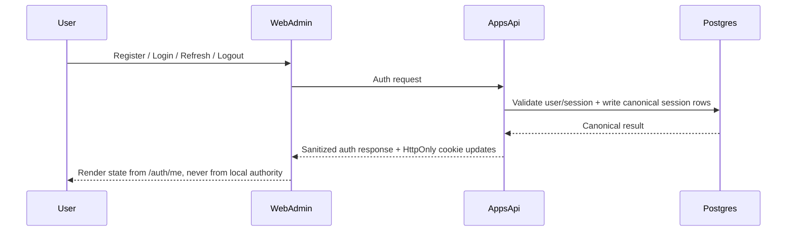

# AUTH_SESSION_FLOW

File này chốt sequence chuẩn cho register / verify / login / refresh / logout / reset-password.
Nó bổ sung cho `SECURITY_POLICY.md` và identity contracts để auth lane không mơ hồ ở thời điểm scaffold.

Authority liên quan:

- [SECURITY_POLICY.md](C:/Users/ADMIN/DEV2/PMTL_VN/design/02-platform-baseline/security-runtime/SECURITY_POLICY.md)
- [design/03-domains/identity/CONTRACTS.md](C:/Users/ADMIN/DEV2/PMTL_VN/design/03-domains/identity/CONTRACTS.md)
- [design/03-domains/identity/USE_CASES/manage-auth-session.md](C:/Users/ADMIN/DEV2/PMTL_VN/design/03-domains/identity/USE_CASES/manage-auth-session.md)

## Primary sequence

## Register -> verify -> login

1. `POST /api/auth/register`
2. account row + verification intent được tạo ở backend authority
3. nếu flow email verification bật, user chưa được coi là fully verified cho đến khi confirm
4. `POST /api/auth/login` chỉ thành công hoàn toàn khi policy cho phép
5. auth bootstrap cho UI luôn đi qua `GET /api/auth/me`

## Refresh rotation

1. `POST /api/auth/refresh`
2. backend đọc session canon
3. refresh rotation là `single canonical transaction`
4. token cũ bị revoke khi token mới được cấp
5. refresh token reuse phải map về `auth.refresh_reused`

## Logout / logout-all

- `POST /api/auth/logout`: revoke current session
- `POST /api/auth/logout-all`: revoke mọi session của principal
- frontend không tự "xóa state local là xong"; authority vẫn là backend session store

## Password reset

1. `POST /api/auth/forgot-password`
2. reset token intent được tạo ở backend
3. `POST /api/auth/reset-password`
4. password đổi thành công thì reset token bị vô hiệu hóa ngay
5. nếu policy yêu cầu, session cũ cũng bị revoke

## OAuth stance

- OAuth không phải baseline phase 1
- nếu bật sau này, callback flow vẫn phải đổ về cùng session authority, cùng cookie policy, cùng `/auth/me` bootstrap contract
- không tạo auth authority thứ hai theo provider

## Forbidden drift

- frontend suy auth state từ cookie presence hoặc persisted store
- refresh rotation không transaction-safe
- logout-all không invalidate canonical sessions
- OAuth callback tự mở session semantics khác baseline auth flow
