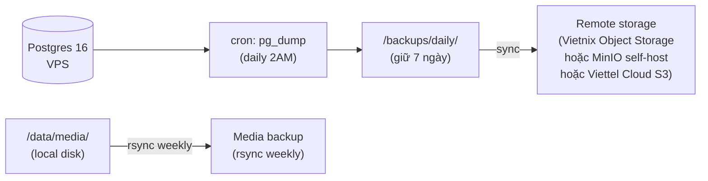

# Backup & Recovery — VPS Canon

File này mở rộng `design/02-platform-baseline/deploy-ops/BACKUP_RESTORE.md` với VPS-specific implementation.
Owner của RPO/RTO targets và minimum contract vẫn là `BACKUP_RESTORE.md`.
File này chốt **cách thực hiện cụ thể** trên VPS self-host.

---

## Backup strategy tổng quan



---

## pg_dump cron script

```bash
#!/bin/bash
# /opt/pmtl/scripts/backup-db.sh

set -euo pipefail

BACKUP_DIR="/opt/pmtl/backups/daily"
TIMESTAMP=$(date +%Y%m%d_%H%M%S)
CONTAINER="pmtl-prod-postgres-1"   # docker compose service name
DB_NAME="${POSTGRES_DB:-pmtl_prod}"
DB_USER="${POSTGRES_USER:-pmtl}"
KEEP_DAYS=7
TELEGRAM_SCRIPT="/opt/pmtl/scripts/alert.sh"

mkdir -p "${BACKUP_DIR}"

# Dump vào file nén
DUMP_FILE="${BACKUP_DIR}/pmtl_${TIMESTAMP}.sql.gz"

docker exec "${CONTAINER}" \
  pg_dump -U "${DB_USER}" -d "${DB_NAME}" --no-password \
  | gzip > "${DUMP_FILE}"

# Kiểm tra dump không rỗng
if [ ! -s "${DUMP_FILE}" ]; then
  ${TELEGRAM_SCRIPT} "[FAIL] pg_dump EMPTY: ${DUMP_FILE}"
  exit 1
fi

SIZE=$(du -sh "${DUMP_FILE}" | cut -f1)
echo "$(date): Backup OK: ${DUMP_FILE} (${SIZE})"

# Xoá dump cũ hơn KEEP_DAYS ngày
find "${BACKUP_DIR}" -name "*.sql.gz" -mtime "+${KEEP_DAYS}" -delete

# Thông báo Telegram thành công (weekly only, tránh spam)
DOW=$(date +%u)  # 1=Mon, 7=Sun
if [ "${DOW}" = "1" ]; then
  ${TELEGRAM_SCRIPT} "[OK] DB backup weekly OK: ${SIZE}"
fi
```

```cron
# /etc/cron.d/pmtl-backup
# Chạy lúc 2:00 AM mỗi ngày
0 2 * * * pmtl /opt/pmtl/scripts/backup-db.sh >> /var/log/pmtl-backup.log 2>&1
```

---

## Remote sync — Ưu tiên provider VN-friendly

### Lựa chọn theo thứ tự ưu tiên

| Provider | Chi phí | Ghi chú |
|---|---|---|
| **Vietnix Object Storage** | ~30-50k VND/tháng/10GB | S3-compatible, datacenter VN, thanh toán VND |
| **Viettel Cloud Object Storage** | ~50k VND/tháng | S3-compatible, datacenter VN |
| **MinIO self-host** | $0 (dùng VPS disk thứ 2) | Hoàn toàn tự kiểm soát, S3-compatible API |
| Cloudflare R2 | $0 (10GB free) | Không phải VN nhưng miễn phí |

### Setup với rclone (S3-compatible — dùng cho Vietnix / Viettel Cloud / MinIO)

```bash
# Cài rclone
curl https://rclone.org/install.sh | sudo bash

# Config S3-compatible provider (Vietnix / Viettel Cloud / MinIO)
rclone config
# → Chọn "s3"
# → Provider: "Other" (cho Vietnix/Viettel) hoặc "Minio"
# → endpoint: <endpoint từ provider — ví dụ storage.vietnix.vn hoặc minio.pmtl.vn:9000>
# → access_key_id + secret_access_key từ provider console

# Test connection
rclone lsd remote:

# Sync backups
rclone sync /opt/pmtl/backups/daily remote:pmtl-backups/daily \
  --transfers 2 \
  --log-level INFO

# Thêm vào cron (sau pg_dump)
30 2 * * * pmtl rclone sync /opt/pmtl/backups/daily remote:pmtl-backups/daily >> /var/log/pmtl-rclone.log 2>&1
```

### MinIO self-host (nếu có VPS thứ 2 hoặc disk dư)

```bash
# Chạy MinIO qua Docker trên VPS backup
docker run -d \
  --name pmtl-minio \
  -p 9000:9000 -p 9001:9001 \
  -v /data/minio:/data \
  -e MINIO_ROOT_USER=pmtl \
  -e MINIO_ROOT_PASSWORD=<strong-password> \
  --restart unless-stopped \
  quay.io/minio/minio server /data --console-address ":9001"

# Tạo bucket pmtl-backups từ MinIO console (port 9001)
# Sau đó dùng rclone với endpoint: http://<vps-ip>:9000
```

---

## 1-click restore procedure

```bash
#!/bin/bash
# /opt/pmtl/scripts/restore-db.sh
# Usage: ./restore-db.sh /opt/pmtl/backups/daily/pmtl_20260327_020000.sql.gz

set -euo pipefail

DUMP_FILE="$1"
CONTAINER="pmtl-prod-postgres-1"
DB_NAME="${POSTGRES_DB:-pmtl_prod}"
DB_USER="${POSTGRES_USER:-pmtl}"

if [ -z "${DUMP_FILE}" ]; then
  echo "Usage: $0 <dump_file.sql.gz>"
  exit 1
fi

echo "[WARN]️  Restore sẽ DROP và tạo lại database ${DB_NAME}"
echo "Nhập 'yes' để tiếp tục:"
read -r CONFIRM
[ "${CONFIRM}" != "yes" ] && exit 0

# Stop app containers (không stop postgres)
docker compose -f /opt/pmtl/infra/docker/docker-compose.prod.yml stop api web admin

# Drop + recreate
docker exec "${CONTAINER}" psql -U "${DB_USER}" -c "DROP DATABASE IF EXISTS ${DB_NAME};"
docker exec "${CONTAINER}" psql -U "${DB_USER}" -c "CREATE DATABASE ${DB_NAME};"

# Restore
gunzip -c "${DUMP_FILE}" | docker exec -i "${CONTAINER}" psql -U "${DB_USER}" -d "${DB_NAME}"

echo "[OK] Restore xong: ${DUMP_FILE}"

# Restart apps
docker compose -f /opt/pmtl/infra/docker/docker-compose.prod.yml start api web admin
```

---

## Restore drill protocol (bắt buộc trước launch)

Theo `design/04-execution-overlay/repo/RESTORE_DRILL_LOG.md`:

1. Chạy `backup-db.sh` thủ công
2. Tạo môi trường test (hoặc dùng staging branch trên cùng VPS)
3. Chạy `restore-db.sh <dump_file>` vào DB staging
4. Verify: app boot, `/health/ready` pass, 1 vài query kiểm tra data
5. Ghi kết quả vào `RESTORE_DRILL_LOG.md`

---

## Media backup (local disk → remote)

```bash
# Weekly sync media lên remote (Vietnix / MinIO / Viettel Cloud)
0 3 * * 0 pmtl rclone sync /opt/pmtl/data/media remote:pmtl-backups/media >> /var/log/pmtl-media-backup.log 2>&1
```

---

## Disk space monitoring

```bash
# Alert khi disk > 80%
# Thêm vào healthcheck cron:
DISK_USAGE=$(df /opt/pmtl | awk 'NR==2 {print $5}' | tr -d '%')
if [ "${DISK_USAGE}" -gt 80 ]; then
  /opt/pmtl/scripts/alert.sh "[WARN]️ Disk usage: ${DISK_USAGE}% — cần dọn dẹp"
fi
```

