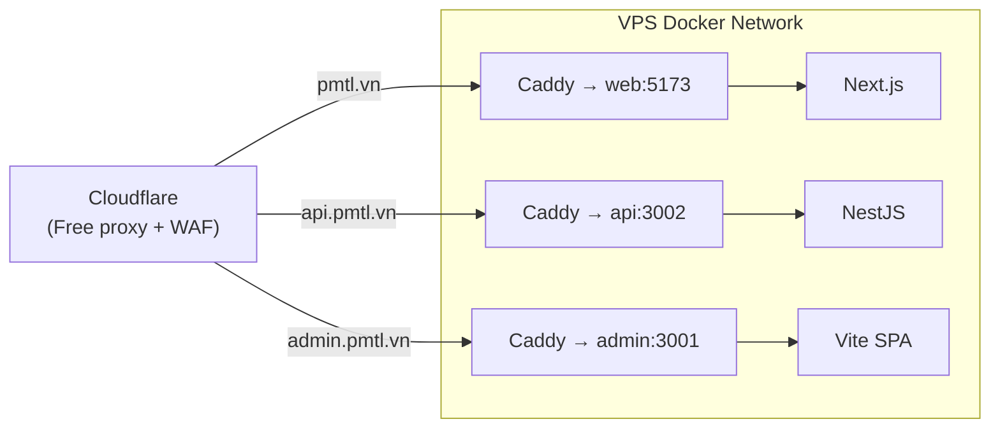

# Caddy Production Config Canon

File này chốt `Caddyfile` template cho VPS self-host với domain sẵn.
Caddy tự động xử lý SSL via Let's Encrypt (hoặc Cloudflare DNS challenge nếu dùng Cloudflare proxy).

> File thật sống tại `infra/docker/caddy/Caddyfile`.

---

## Caddyfile template (domain sẵn + Cloudflare free proxy)

```caddyfile
# infra/docker/caddy/Caddyfile
{
  # Global options
  email admin@pmtl.vn
  # Nếu dùng Cloudflare proxy: dùng DNS challenge thay ACME HTTP
  # acme_dns cloudflare {env.CF_API_TOKEN}
}

# Public frontend
pmtl.vn, www.pmtl.vn {
  reverse_proxy web:5173

  # Cache static assets
  @static {
    path /_next/static/* /favicon.ico /robots.txt /sitemap.xml
  }
  header @static Cache-Control "public, max-age=31536000, immutable"

  # Compression
  encode zstd gzip

  # Security headers
  header {
    X-Frame-Options "SAMEORIGIN"
    X-Content-Type-Options "nosniff"
    Referrer-Policy "strict-origin-when-cross-origin"
    -Server
  }

  log {
    output file /var/log/caddy/web-access.log {
      roll_size 10mb
      roll_keep 5
    }
  }
}

# API backend
api.pmtl.vn {
  reverse_proxy api:3002

  # Rate limit note: app-layer rate limit trong NestJS là primary
  # Caddy rate limit plugin nếu muốn thêm edge layer

  header {
    -Server
    X-Content-Type-Options "nosniff"
  }

  log {
    output file /var/log/caddy/api-access.log {
      roll_size 10mb
      roll_keep 5
    }
  }
}

# Admin panel — chặn theo IP nếu cần
admin.pmtl.vn {
  # Uncomment để chặn chỉ cho phép IP VPN/home:
  # @blocked not remote_ip 1.2.3.4 5.6.7.8
  # respond @blocked 403

  reverse_proxy admin:3001

  header {
    X-Frame-Options "DENY"
    -Server
  }
}

# Uptime Kuma — internal monitoring (chỉ truy cập qua VPN hoặc localhost tunnel)
# status.pmtl.vn {
#   reverse_proxy uptime-kuma:3001
# }
```

---

## Mermaid: Caddy routing flow



---

## DNS setup (Cloudflare free)

| Record | Type | Value | Proxy |
|---|---|---|---|
| `pmtl.vn` | A | `<VPS_IP>` | [OK] Proxied |
| `www` | CNAME | `pmtl.vn` | [OK] Proxied |
| `api` | A | `<VPS_IP>` | [OK] Proxied |
| `admin` | A | `<VPS_IP>` | [OK] Proxied |

**Lưu ý**: Khi dùng Cloudflare proxy, Caddy cần `tls internal` hoặc dùng Cloudflare Origin Certificate thay vì Let's Encrypt public, vì traffic từ Cloudflare đến VPS là encrypted riêng.

### Option A — Cloudflare Flexible SSL (đơn giản nhất)
- Cloudflare xử lý SSL với browser
- Caddy chỉ cần serve HTTP (port 80) → Cloudflare tự negotiate

### Option B — Cloudflare Full SSL (recommended)
- Cloudflare cấp Origin Certificate cho VPS
- Caddy dùng cert đó để TLS từ Cloudflare → VPS

```caddyfile
# Option B: Cloudflare origin cert
pmtl.vn {
  tls /etc/caddy/certs/cloudflare-origin.pem /etc/caddy/certs/cloudflare-origin-key.pem
  reverse_proxy web:5173
}
```

---

## Không được làm

- Không expose port 80/443 trực tiếp từ `apps/api` hay `apps/web` — phải qua Caddy
- Không dùng nginx nếu đã dùng Caddy (tránh 2 reverse proxy)
- Không tắt HTTPS trên production
- Không để admin panel public không có auth layer hoặc IP restriction

