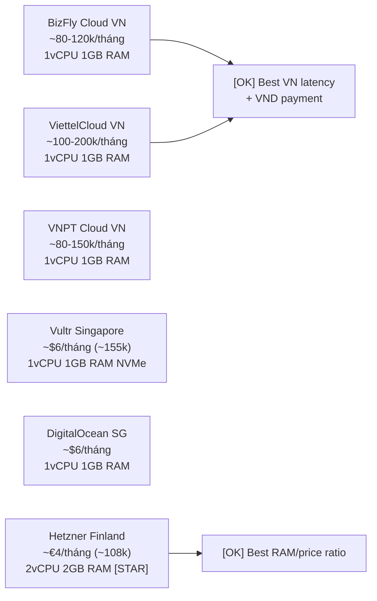

# Cost-Zero VPS Guide — Dành cho sinh viên

Hướng dẫn deploy PMTL_VN với chi phí thấp nhất có thể trên VPS self-host.
Target: sinh viên VN, ngân sách ~100-200k VND/tháng, domain sẵn.

---

## Chi phí thực tế ước tính

| Khoản | Chi phí | Ghi chú |
|---|---|---|
| **VPS** | 80–200k VND/tháng | Xem bảng provider bên dưới |
| **Domain** | 0 (đã có sẵn) | — |
| **SSL** | **Miễn phí** | Caddy + Let's Encrypt tự động |
| **CDN** | **Miễn phí** | Cloudflare Free plan |
| **Monitoring** | **Miễn phí** | Uptime Kuma self-host trên VPS |
| **Backup storage** | **Miễn phí** | Backblaze B2 10GB free / Cloudflare R2 10GB |
| **Search** | **Miễn phí** | Meilisearch self-host trên VPS |
| **Email** | **Miễn phí** | Brevo (Sendinblue) free 300 email/ngày |
| **CI/CD** | **Miễn phí** | GitHub Actions 2000 phút/tháng |
| **Container registry** | **Miễn phí** | GitHub Container Registry (GHCR) |
| **TỔNG** | **~100–200k VND/tháng** | Chỉ trả tiền VPS |

---

## VPS providers VN-friendly, rẻ nhất 2026



**Khuyến nghị thực tế:**
- Nếu muốn thanh toán VND + support tiếng Việt: **BizFly Cloud** hoặc **ViettelCloud**
- Nếu muốn giá tốt nhất + RAM nhiều nhất: **Hetzner** (latency ~180ms từ VN, chấp nhận được)
- Nếu muốn latency thấp nhất + ổn định: **Vultr Singapore** hoặc **DigitalOcean Singapore**

---

## Free services sử dụng

### Email transactional — Brevo (Sendinblue)
- Free: 300 emails/ngày, không cần thẻ credit
- Dùng cho: email xác thực, password reset
- Setup: lấy SMTP credentials → thêm vào `.env.production`

```env
SMTP_HOST=smtp-relay.brevo.com
SMTP_PORT=587
SMTP_USER=your@email.com
SMTP_PASS=your-brevo-smtp-key
EMAIL_FROM=noreply@pmtl.vn
```

### Backup — Backblaze B2
- Free: 10GB storage + 1GB download/ngày
- Setup: tạo account → tạo bucket → lấy App Key → config rclone
- Xem chi tiết: `./BACKUP_RECOVERY_VPS.md`

### CDN + WAF — Cloudflare Free
- Free: unlimited bandwidth CDN, DDoS protection cơ bản, free SSL
- Setup: đổi nameserver domain về Cloudflare → bật proxy cho A records
- Xem chi tiết: `./CADDY_PROD_CONFIG.md`

### Monitoring — Uptime Kuma
- Self-host trên VPS, không tốn thêm tiền
- Telegram alert hoàn toàn miễn phí
- RAM footprint: ~50MB

---

## Optimization RAM cho VPS 1GB

Phase 1 — chỉ chạy core stack:

```yaml
# Tắt Prometheus/Grafana/Loki khi RAM < 2GB
# Chỉ giữ:
services:
  caddy:      # ~20MB
  web:        # ~150MB
  api:        # ~200MB
  admin:      # ~50MB (static SPA)
  postgres:   # ~80MB
  meilisearch: # ~150MB
  uptime-kuma: # ~50MB
# Total: ~700MB → còn ~300MB buffer cho OS
```

Khi có RAM 2GB: thêm Prometheus (~80MB) + Grafana (~150MB) + Loki (~100MB).

---

## Tối ưu Postgres RAM (1GB VPS)

```sql
-- /etc/postgresql/16/main/postgresql.conf hoặc mount vào Docker
shared_buffers = 128MB      -- 25% RAM tối đa
work_mem = 4MB
maintenance_work_mem = 64MB
max_connections = 20        -- giảm từ 100 mặc định
```

---

## GitHub Actions CI/CD — miễn phí

```yaml
# .github/workflows/deploy.yml (template cơ bản)
name: Deploy to VPS

on:
  push:
    branches: [main]

jobs:
  deploy:
    runs-on: ubuntu-latest
    steps:
      - uses: actions/checkout@v4

      - name: Build and push Docker images
        run: |
          echo ${{ secrets.GHCR_TOKEN }} | docker login ghcr.io -u ${{ github.actor }} --password-stdin
          docker build -t ghcr.io/${{ github.repository }}/pmtl-api:${{ github.sha }} apps/api
          docker push ghcr.io/${{ github.repository }}/pmtl-api:${{ github.sha }}

      - name: Deploy to VPS
        uses: appleboy/ssh-action@master
        with:
          host: ${{ secrets.VPS_HOST }}
          username: pmtl
          key: ${{ secrets.VPS_SSH_KEY }}
          script: |
            cd /opt/pmtl
            IMAGE_TAG=${{ github.sha }} docker compose -f infra/docker/docker-compose.prod.yml pull api
            docker compose -f infra/docker/docker-compose.prod.yml up -d --no-deps api
            docker compose exec api npx prisma migrate deploy
```

GitHub Actions **2000 phút/tháng miễn phí** cho public repo, **500 phút** cho private.
Một deploy ~3-5 phút → có thể deploy ~100-400 lần/tháng miễn phí.

---

## Checklist tiết kiệm chi phí

- [ ] Dùng Cloudflare Free plan (CDN + SSL) — không trả tiền cert
- [ ] Dùng Brevo free tier (300 email/ngày) — không trả tiền email
- [ ] Dùng Backblaze B2 / Cloudflare R2 free tier cho backup
- [ ] Dùng GitHub Container Registry (GHCR) thay Docker Hub
- [ ] Dùng GitHub Actions free minutes thay paid CI
- [ ] Dùng Uptime Kuma self-host thay Statuspage paid
- [ ] Optimize `max_connections` Postgres để tiết kiệm RAM
- [ ] Tắt Prometheus/Grafana khi chưa cần (defer đến RAM 2GB)

