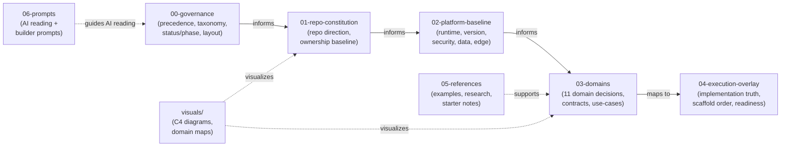

# PMTL_VN Design

Thư mục này chốt architecture (kiến trúc), boundary (ranh giới trách nhiệm), ownership (quyền sở hữu dữ liệu), và launch guardrails (rào chắn bảo vệ khi ra mắt) cho PMTL_VN.
Nó không phải bằng chứng rằng runtime (môi trường thực thi) đã tồn tại.

## Governance First

Từ bây giờ `design/` phải được đọc theo governance layer trước, không đọc theo thói quen folder cũ.

Đọc theo thứ tự:

1. [design/00-governance/README.md](./00-governance/README.md)
2. [design/00-governance/GOVERNANCE_SYSTEM.md](./00-governance/GOVERNANCE_SYSTEM.md)
3. [design/00-governance/STATUS_AND_PHASE.md](./00-governance/STATUS_AND_PHASE.md)
4. [design/00-governance/FOLDER_CANON.md](./00-governance/FOLDER_CANON.md)
5. [design/00-governance/IMPORT_AND_FORMAT.md](./00-governance/IMPORT_AND_FORMAT.md)
6. [design/00-governance/MIGRATION_MAP.md](./00-governance/MIGRATION_MAP.md)

## Canonical Layers

`design/` nên được hiểu thành 7 lớp:

- `00-governance`
- `01-repo-constitution`
- `02-platform-baseline`
- `03-domains`
- `04-execution-overlay`
- `05-references`
- `06-prompts`

**Source priority** (higher = wins on conflict): `00` > `01` > `02` > `03` > `04` > `05` > `06`.
Exception: `04-execution-overlay` wins cho **implementation/runtime truth** bất kể layer nào nói gì.

Folder legacy đã được thay bằng layout canonical; nếu cần lần lại tên cũ thì đọc `MIGRATION_MAP.md`.

## Current truth (Thực trạng hiện tại)

- Đây là `target design (thiết kế mục tiêu)` cho hướng `rebuild backend (xây dựng lại hệ thống phía sau)` với NestJS.
- Không file nào trong `design/` được coi là `implemented (đã triển khai)` nếu chưa có:
  - code reference (tham chiếu mã nguồn)
  - route/module/service (đường dẫn/mô-đun/lớp xử lý nghiệp vụ) tương ứng
  - schema/migration (lược đồ/di cư dữ liệu) tương ứng
  - runtime artifact (sản phẩm thực thi) tương ứng
- File khóa sổ chuyện này là [implementation-mapping.md](./04-execution-overlay/repo/IMPLEMENTATION_MAPPING.md).
- Các rule cho major versions hiện hành đã được rà lại ở mức design vào `2026-03-21`; implementation/runtime truth vẫn phải khóa ở `implementation-mapping.md`, không suy từ audit notes hay overview docs.
- Exact version/runtime pins và official doc entrypoints phải đọc ở [version-matrix.md](./02-platform-baseline/dependency-version/VERSION_MATRIX.md), không suy từ README hay owner docs khác.

## Orientation in 2 files

- Muốn hiểu kiến trúc trong 1 phút: [architecture-at-a-glance.md](./01-repo-constitution/ARCHITECTURE_AT_A_GLANCE.md)
- Muốn biết tech nào được bật khi nào: [phase-activation-matrix.md](./01-repo-constitution/PHASE_ACTIVATION_MATRIX.md)

## Readiness semantics

- Canonical vocabulary owner là [STATUS_AND_PHASE.md](./00-governance/STATUS_AND_PHASE.md).
- `design-ready` = design đủ rõ để bắt đầu implementation planning.
- `implementation-ready` = artifact runtime dự kiến và owner code path đã được map đủ cụ thể.
- `launch-ready` = launch blockers thật đã pass, gồm runtime evidence như restore drill.

Các dòng trên chỉ là `quick orientation (định hướng đọc nhanh)`.
Runtime truth owner vẫn là [implementation-mapping.md](./04-execution-overlay/repo/IMPLEMENTATION_MAPPING.md); nếu wording ở README và owner docs khác nhau thì owner docs thắng.

`design-ready` nghĩa là design đã đủ rõ, không có nghĩa code/runtime đã tồn tại. Runtime truth luôn đọc ở [implementation-mapping.md](./04-execution-overlay/repo/IMPLEMENTATION_MAPPING.md).

## First-launch scope (Phạm vi ra mắt lần đầu)

- Full Phase 1 baseline owner: [DECISIONS.md](./01-repo-constitution/DECISIONS.md) section 2.
- Deferred / excluded tech owner: [DECISIONS.md](./01-repo-constitution/DECISIONS.md) sections 3 and 15, plus [phase-activation-matrix.md](./01-repo-constitution/PHASE_ACTIVATION_MATRIX.md).
- README chỉ giữ shorthand để khỏi lặp full list:
  - first launch = `apps/web + apps/api + apps/admin` trên `Postgres + Caddy` với logs, `/health/*`, `/metrics`, storage abstraction, auth/upload hardening, audit logs, feature flags, rate limit, và restore discipline
  - optional-scale lanes như `Valkey`, `BullMQ`, `Meilisearch`, `PgBouncer`, Prometheus/Grafana/Alertmanager, và tracing mặc định vẫn tắt cho đến khi trigger docs cho phép
  - `pgvector` là `explicit exclusion`, không phải deferred thông thường

## Repo quickstart (Khởi động nhanh kho mã nguồn)

### Prerequisites (Điều kiện tiên quyết)

- `Node.js 20.18.0` (LTS)
- `pnpm 10.x`
- `just` (task runner — repo wraps mọi workflow qua Justfile)
- Docker / Docker Compose (local services)

### Commands (Các lệnh)

Repo-first commands dùng `just` (không dùng pnpm trực tiếp):

| Mục tiêu | Lệnh |
|---|---|
| Bootstrap lần đầu | `just bootstrap` |
| Dev core (api + web) | `just dev-core` |
| Dev full (all services) | `just dev-full` |
| Stop dev | `just dev-stop` |
| Rebuild containers | `just dev-rebuild` |
| Xem logs | `just dev-logs` |
| Verify web | `just verify-web` |
| Verify backend/API | `just verify-cms` |
| Verify tất cả | `just verify-all` |
| Smoke test | `just smoke` |
| Auth check | `just auth-check` |
| Search check | `just search-check` |

Fallback package scripts (khi không có `just`):

- `pnpm lint` / `pnpm typecheck` / `pnpm test` / `pnpm build`

### Runtime entrypoints (Các điểm đầu vào thực thi)

- `apps/web`: public frontend (giao diện công khai)
- `apps/api`: backend chính (hệ thống xử lý chính)
- `apps/admin`: admin UI riêng (giao diện quản trị)
- `infra`: deploy/proxy/ops scripts (kịch bản triển khai và vận hành)
- `design`: target architecture (kiến trúc mục tiêu) + contracts (hợp đồng nghiệp vụ) + launch gates (cổng kiểm soát ra mắt)

## Launch gate (Cổng kiểm soát ra mắt)

Owner của launch-readiness truth là [implementation-mapping.md](./04-execution-overlay/repo/IMPLEMENTATION_MAPPING.md); checklist dưới đây chỉ là summary operator-facing.

- [ ] auth/session policy finalized (chốt xong chính sách phiên đăng nhập)
- [ ] upload/media policy finalized (chốt xong chính sách truyền thông/tải lên)
- [ ] `audit_logs` implemented (đã triển khai nhật ký kiểm tra)
- [ ] `feature_flags` implemented (đã triển khai cờ tính năng)
- [ ] rate-limit path implemented (đã triển khai rõ đường đi giới hạn tần suất)
- [ ] local storage abstraction implemented (đã triển khai lớp trừu tượng lưu trữ nội bộ)
- [ ] `/health/live`, `/health/ready`, `/health/startup` implemented (đã triển khai đầy đủ các đường kiểm tra sức khỏe)
- [ ] `/metrics` implemented (đã triển khai endpoint chỉ số tối thiểu)
- [ ] restore drill passed (diễn tập phục hồi đã vượt qua)
- [ ] first incident runbook written (đã viết xong tài liệu xử lý sự cố đầu tiên)
- [ ] first risky write-path reviewed end-to-end (đã rà soát xong luồng ghi dữ liệu rủi ro đầu tiên từ đầu đến cuối)

## Read in order (Thứ tự đọc)

### Core path

1. [DECISIONS.md](./01-repo-constitution/DECISIONS.md)
2. [ROOT_DOC_OWNERSHIP.md](./01-repo-constitution/ROOT_DOC_OWNERSHIP.md)
3. [architecture-at-a-glance.md](./01-repo-constitution/ARCHITECTURE_AT_A_GLANCE.md)
4. [phase-activation-matrix.md](./01-repo-constitution/PHASE_ACTIVATION_MATRIX.md)
5. [version-matrix.md](./02-platform-baseline/dependency-version/VERSION_MATRIX.md)
6. [implementation-mapping.md](./04-execution-overlay/repo/IMPLEMENTATION_MAPPING.md)

### Backend/API path

1. [repo-structure.md](./01-repo-constitution/REPO_STRUCTURE.md)
2. [nest-baseline.md](./02-platform-baseline/api-runtime/NEST_REQUEST_PIPELINE.md)
3. [zod-4-runtime-policy.md](./02-platform-baseline/api-runtime/ZOD_4_RUNTIME_POLICY.md)
4. [nestjs-11-adoption.md](./02-platform-baseline/api-runtime/NESTJS_11_ADOPTION.md)
5. [prisma-7-policy.md](./02-platform-baseline/data-runtime/PRISMA_7_POLICY.md)
6. [prisma-query-pattern-rules.md](./02-platform-baseline/data-runtime/PRISMA_QUERY_PATTERN_RULES.md)
7. [error-envelope-contract.md](./02-platform-baseline/api-runtime/ERROR_ENVELOPE_CONTRACT.md)
8. [security.md](./02-platform-baseline/security-runtime/SECURITY_POLICY.md)
9. [auth-session-flow.md](./02-platform-baseline/security-runtime/AUTH_SESSION_FLOW.md)
10. [apps-api-implementation-canon.md](./04-execution-overlay/api/APPS_API_IMPLEMENTATION_CANON.md)

### Web/Admin path

1. [frontend-architecture.md](./02-platform-baseline/web-runtime/FRONTEND_ARCHITECTURE.md)
2. [react-runtime-policy.md](./02-platform-baseline/web-runtime/REACT_RUNTIME_POLICY.md)
3. [tailwind-css-4-policy.md](./02-platform-baseline/web-runtime/TAILWIND_CSS_4_POLICY.md)
4. [shadcn-ui-inventory.md](./02-platform-baseline/web-runtime/SHADCN_UI_INVENTORY.md)
5. [zustand-policy.md](./02-platform-baseline/web-runtime/ZUSTAND_POLICY.md)
6. [component-specs.md](./02-platform-baseline/web-runtime/COMPONENT_SPECS.md)
7. [page-inventory.md](./04-execution-overlay/web/PAGE_INVENTORY.md)
8. [apps-web-implementation-canon.md](./04-execution-overlay/web/APPS_WEB_IMPLEMENTATION_CANON.md)

### Ops/Review path

1. [ai-debugging-discipline.md](./02-platform-baseline/deploy-ops/AI_DEBUGGING_DISCIPLINE.md)
2. [dependency-governance.md](./02-platform-baseline/dependency-version/DEPENDENCY_GOVERNANCE.md)
3. [testing-strategy.md](./02-platform-baseline/deploy-ops/TESTING_STRATEGY.md)
4. [observability-architecture.md](./02-platform-baseline/deploy-ops/OBSERVABILITY_ARCHITECTURE.md)
5. [valkey-runtime-drill.md](./02-platform-baseline/deploy-ops/VALKEY_RUNTIME_DRILL.md)

## Key docs by purpose (Nhóm tài liệu chính)

### Backend baseline
| File | Nội dung |
|---|---|
| [startup-dependency-order.md](./02-platform-baseline/api-runtime/STARTUP_DEPENDENCY_ORDER.md) | Thứ tự khởi động platform modules + fail behavior |
| [zod-4-runtime-policy.md](./02-platform-baseline/api-runtime/ZOD_4_RUNTIME_POLICY.md) | Zod 4 source-of-truth chain, schema placement, error policy, metadata/JSON Schema/codecs stance |
| [nest-feature-adoption-matrix.md](./02-platform-baseline/api-runtime/NEST_FEATURE_ADOPTION_MATRIX.md) | Bảng tổng adopted/restricted/deferred/excluded/reference-only cho toàn bộ surface Nest dùng trong repo |
| [nestjs-11-adoption.md](./02-platform-baseline/api-runtime/NESTJS_11_ADOPTION.md) | Exact Nest 11 scaffold line, Express v5 route stance, logger policy, và các nuance riêng của Nest 11 |
| [outbox-event-taxonomy.md](./04-execution-overlay/cross-module/OUTBOX_EVENT_TAXONOMY.md) | Event nào đi outbox, event schema, idempotency |
| [unified-index-mapping.md](./03-domains/search/REFERENCES/UNIFIED_INDEX_MAPPING.md) | Field mapping Content + Wisdom-QA → search index |
| [offline-bundle-delta-sync.md](./03-domains/wisdom-qa/REFERENCES/OFFLINE-BUNDLE-DELTA-SYNC.MD) | Delta sync schema cho offline bundles |
| [assisted-entry-workflow.md](./03-domains/vows-merit/REFERENCES/ASSISTED_ENTRY_WORKFLOW.md) | Workflow admin nhập liệu thay member |
| [advisory-ownership.md](./03-domains/calendar/REFERENCES/ADVISORY-OWNERSHIP.MD) | Ranh giới Calendar vs Wisdom-QA |
| [luc-trai-days-canon.md](./03-domains/calendar/REFERENCES/LUC-TRAI-DAYS-CANON.MD) | Canon cho `六齋日`: day-role matrix, fallback semantics, warning/profile, admin obligations |
| [organizational-events-architecture.md](./03-domains/calendar/REFERENCES/ORGANIZATIONAL-EVENTS-ARCHITECTURE.MD) | Kiến trúc sự kiện tổ chức: agenda, speakers, CTA, assets |
| [daily-practice-experience-architecture.md](./03-domains/content/REFERENCES/DAILY-PRACTICE-EXPERIENCE-ARCHITECTURE.MD) | Kiến trúc public/admin/tracker cho Kinh Bài Tập Hằng Ngày |
| [daily-practice-content-inventory.md](./03-domains/content/REFERENCES/DAILY-PRACTICE-CONTENT-INVENTORY.MD) | Inventory canonical cho groups, guides, presets, FAQ, downloads |
| [kinh-van-tu-tu-content-inventory.md](./03-domains/content/REFERENCES/KINH-VAN-TU-TU-CONTENT-INVENTORY.MD) | Inventory canonical cho Kinh Văn Tự Tu từ bộ ảnh hướng dẫn và route companion surface |
| [life-release-experience-architecture.md](./03-domains/content/REFERENCES/LIFE-RELEASE-EXPERIENCE-ARCHITECTURE.MD) | Kiến trúc public/admin/journal bridge cho Phóng Sanh |
| [life-release-content-inventory.md](./03-domains/content/REFERENCES/LIFE-RELEASE-CONTENT-INVENTORY.MD) | Inventory canonical cho nghi thức, variants, warnings, FAQ, downloads của Phóng Sanh |
| [life-release-guide-nghi-thuc-co-ban.md](./03-domains/content/REFERENCES/LIFE-RELEASE-GUIDE-NGHI-THUC-CO-BAN.MD) | Canonical guide cho route nghi thức cơ bản của Phóng Sanh |
| [life-release-guide-cho-ban-than.md](./03-domains/content/REFERENCES/LIFE-RELEASE-GUIDE-CHO-BAN-THAN.MD) | Canonical guide cho variant Phóng Sanh hồi hướng cho bản thân |
| [life-release-guide-cho-nguoi-khac.md](./03-domains/content/REFERENCES/LIFE-RELEASE-GUIDE-CHO-NGUOI-KHAC.MD) | Canonical guide cho variant Phóng Sanh hồi hướng cho người khác |
| [life-release-guide-luu-y-va-chuan-bi.md](./03-domains/content/REFERENCES/LIFE-RELEASE-GUIDE-LUU-Y-VA-CHUAN-BI.MD) | Checklist, guardrails, và warning đạo đức cho Phóng Sanh |
| [life-release-guide-xu-ly-khi-co-loai-vat-tu-vong.md](./03-domains/content/REFERENCES/LIFE-RELEASE-GUIDE-XU-LY-KHI-CO-LOAI-VAT-TU-VONG.MD) | Guide nhạy cảm cho flow phát sinh khi có loài vật tử vong |
| [life-release-guide-hoi-dap.md](./03-domains/content/REFERENCES/LIFE-RELEASE-GUIDE-HOI-DAP.MD) | FAQ seed cho Phóng Sanh |
| [media-library-experience-architecture.md](./03-domains/content/REFERENCES/MEDIA-LIBRARY-EXPERIENCE-ARCHITECTURE.MD) | Kiến trúc hub thư viện ảnh/video pháp môn và owner split với Wisdom-QA, Calendar |
| [media-library-content-inventory.md](./03-domains/content/REFERENCES/MEDIA-LIBRARY-CONTENT-INVENTORY.MD) | Inventory canonical cho hub, collections, featured slots, và admin workspace của thư viện pháp môn |
| [baihua-audiobook-text-first-architecture.md](./03-domains/wisdom-qa/REFERENCES/BAIHUA-AUDIOBOOK-TEXT-FIRST-ARCHITECTURE.MD) | Kiến trúc text-first cho nguồn audiobook Bạch thoại theo sách / chương / audio companion |
| [btpp-library-canon.md](./03-domains/wisdom-qa/REFERENCES/BTPP-LIBRARY-CANON.MD) | Canon route/IA/glossary/source taxonomy/FAQ/warnings cho Bạch thoại Phật pháp |
| [manual-translation-editor-workflow.md](./03-domains/wisdom-qa/REFERENCES/MANUAL-TRANSLATION-EDITOR-WORKFLOW.MD) | Workflow editor hiện tại: dịch tay, duplicate-check, slug-preview, draft gate, review trước publish |
| [translation-automation-architecture.md](./02-platform-baseline/optional-scale/TRANSLATION_AUTOMATION_ARCHITECTURE.md) | Kiến trúc auto-ingest/auto-translate: orchestrator, duplicate guard, slug preview, import job lifecycle, MCP/API stance |
| [wisdom-qa-family-audit.md](./04-execution-overlay/api/WISDOM_QA_FAMILY_AUDIT.md) | Audit inventory theo từng family của module Wisdom-QA, gồm gaps còn mở và anti-drift rules |
| [xlch-official-alignment.md](./05-references/external-research/XLCH_OFFICIAL_ALIGNMENT.md) | Những family và ranh giới nội dung PMTL phải preserve từ site official `xlch.org` |
| [baihua-audiobook-ingestion-inventory.md](./03-domains/wisdom-qa/REFERENCES/BAIHUA-AUDIOBOOK-INGESTION-INVENTORY.MD) | Inventory các lớp dữ liệu cần ingest từ source audiobook |
| [prisma-schema-plan.md](./04-execution-overlay/data/PRISMA_SCHEMA_PLAN.md) | Merge 10 .dbml → Prisma schema, enums, FK graph, naming |
| [prisma-query-pattern-rules.md](./02-platform-baseline/data-runtime/PRISMA_QUERY_PATTERN_RULES.md) | Canon cho select/include/omit, relation queries, null/undefined, raw SQL/TypedSQL, và pooling notes |

### Infra & Ops — Phase 2+ ready design docs
| File | Nội dung |
|---|---|
| [valkey-architecture.md](./02-platform-baseline/optional-scale/VALKEY_ARCHITECTURE.md) | Valkey topology, key namespaces, rate-limit migration, failure modes, rollback |
| [valkey-module-opportunity-matrix.md](./04-execution-overlay/repo/VALKEY_MODULE_OPPORTUNITY_MATRIX.md) | Ma trận module nào đáng dùng Valkey, trigger gì đủ mạnh, anti-goal gì phải tránh |
| [valkey-cache-candidate-inventory.md](./04-execution-overlay/repo/VALKEY_CACHE_CANDIDATE_INVENTORY.md) | Inventory cache families, TTL classes, invalidation owner, explicit do-not-cache list |
| [bullmq-worker-architecture.md](./02-platform-baseline/optional-scale/BULLMQ_WORKER_ARCHITECTURE.md) | Queue definitions, job schemas, idempotency, dead-letter, worker entrypoint |
| [bullmq-activation-shortlist.md](./04-execution-overlay/repo/BULLMQ_ACTIVATION_SHORTLIST.md) | Workload nào được phép promote lên BullMQ trước, trigger gì đủ, cái gì chưa nên queue |
| [bullmq-implementation-canon.md](./04-execution-overlay/repo/BULLMQ_IMPLEMENTATION_CANON.md) | File placement, producer/worker seams, naming canon, must-exist artifacts khi scaffold queue lane |
| [otel-implementation-canon.md](./04-execution-overlay/repo/OTEL_IMPLEMENTATION_CANON.md) | File placement, bootstrap seams, collector pipeline, resource/propagation/sampling canon cho lane OTEL |
| [outbox-dispatcher-model.md](./02-platform-baseline/optional-scale/OUTBOX_DISPATCHER_MODEL.md) | outbox_events schema, dispatcher cron, retry/dead-letter, redrive API |
| [meilisearch-architecture.md](./02-platform-baseline/optional-scale/MEILISEARCH_ARCHITECTURE.md) | Index settings, sync strategy, SQL fallback contract, monitoring |
| [pgbouncer-strategy.md](./02-platform-baseline/optional-scale/PGBOUNCER_STRATEGY.md) | Pool mode, trigger threshold, Docker Compose config, rollback |
| [r2-migration-plan.md](./02-platform-baseline/optional-scale/R2_MIGRATION_PLAN.md) | Storage adapter interface, 8-step migration, dual-read period, rollback |
| [push-notification-architecture.md](./02-platform-baseline/optional-scale/PUSH_NOTIFICATION_ARCHITECTURE.md) | VAPID Web Push, subscription lifecycle, worker handler, admin ops |
| [observability-architecture.md](./02-platform-baseline/deploy-ops/OBSERVABILITY_ARCHITECTURE.md) | Phase 1 health+metrics, Phase 2 Prometheus+Grafana+Alertmanager, Phase 3 OTEL |
| [valkey-runtime-drill.md](./02-platform-baseline/deploy-ops/VALKEY_RUNTIME_DRILL.md) | Bring-up checklist, fallback/rollback drill, Redis Insight inspection rules, operator evidence |
| [pgvector-decision.md](./02-platform-baseline/optional-scale/PGVECTOR_DECISION.md) | Explicit exclusion with boundary, trigger conditions, artifact list if activated |

### Security & Ops — Phase 1 required
| File | Nội dung |
|---|---|
| [email-provider-decision.md](./02-platform-baseline/security-runtime/EMAIL_PROVIDER_DECISION.md) | Brevo SMTP, delivery failure policy, retry semantics, anti-enumeration |
| [storage-lifecycle.md](./02-platform-baseline/data-runtime/STORAGE_LIFECYCLE.md) | Asset state machine, 5 cleanup jobs, upload quota, disk monitoring |
| [cache-topology.md](./02-platform-baseline/data-runtime/CACHE_TOPOLOGY.md) | 4-layer cache, invalidation rules, ISR, TanStack Query staleTime, Valkey cache |
| [ai-debugging-discipline.md](./02-platform-baseline/deploy-ops/AI_DEBUGGING_DISCIPLINE.md) | Evidence-first rules for using LLMs during debugging, root-cause analysis, and fix verification |
| [version-matrix.md](./02-platform-baseline/dependency-version/VERSION_MATRIX.md) | Exact installed truth vs design pin vs activation-time pin, plus official docs entrypoints per runtime |
| [dependency-governance.md](./02-platform-baseline/dependency-version/DEPENDENCY_GOVERNANCE.md) | Version policy, stable/RC policy, monthly review cadence, advisory intake, migration checklists |
| [managed-platform-patterns.md](./02-platform-baseline/dependency-version/MANAGED_PLATFORM_PATTERNS.md) | What PMTL can learn from Supabase-like platforms without giving up `apps/api` authority |
| [secret-management.md](./02-platform-baseline/security-runtime/SECRET_MANAGEMENT.md) | Secret inventory, rotation procedures, compromise response, .gitignore enforcement |
| [cicd-deploy-gates.md](./02-platform-baseline/deploy-ops/CICD_DEPLOY_GATES.md) | GitHub Actions CI/CD, 4 automated gates + 1 human gate, auto-rollback |
| [deploy-record-template.md](./04-execution-overlay/repo/DEPLOY_RECORD_TEMPLATE.md) | Canonical post-deploy evidence template: artifact chain, smoke results, rollback-proof fields |
| [waf-antibot-strategy.md](./02-platform-baseline/edge-delivery/WAF_ANTIBOT_STRATEGY.md) | Cloudflare WAF rules, Bot Fight Mode, honeypot, CSP nonce, security headers |
| [external-web-check-readiness.md](./05-references/framework-docs/EXTERNAL_WEB_CHECK_READINESS.md) | Web-check categories nào design cover được, categories nào phải đợi runtime evidence, và cách diễn giải kết quả scan ngoài |
| [health-contract.md](./02-platform-baseline/api-runtime/HEALTH_CONTRACT.md) | Exact check lists for /health/live, /health/ready, /health/startup |

### SEO & GEO
| File | Nội dung |
|---|---|
| [strategy.md](./02-platform-baseline/web-runtime/seo-geo/STRATEGY.md) | Owner chiến lược SEO/GEO: URL strategy, robots.txt, sitemap, canonical/hreflang, CWV targets |
| [structured-data.md](./02-platform-baseline/web-runtime/seo-geo/STRUCTURED_DATA.md) | Schema.org mapping per page family, JSON-LD obligations, rich-result posture |
| [geo-citation-strategy.md](./02-platform-baseline/web-runtime/seo-geo/GEO_CITATION_STRATEGY.md) | GEO cho AI engines: entity pages, citation format, quotability rules |
| [content-cluster-map.md](./02-platform-baseline/web-runtime/seo-geo/CONTENT_CLUSTER_MAP.md) | Cluster map cho pillar/cluster content theo surface chính |
| [little-house-seo.md](./03-domains/content/REFERENCES/LITTLE_HOUSE_SEO.md) | SEO chuyên biệt cho surface `Ngôi Nhà Nhỏ` |

### System Orientation
| File | Nội dung |
|---|---|
| [system-data-flow-map.md](./01-repo-constitution/SYSTEM_DATA_FLOW_MAP.md) | Bản đồ request -> module đọc -> module ghi -> side effect cho toàn bộ 11 module, viết theo kiểu đời thường nhưng giữ thuật ngữ kỹ thuật |

### Residual Cleanup
| File | Nội dung |
|---|---|
| [design-doc-residual-backlog.md](./04-execution-overlay/repo/DESIGN_DOC_RESIDUAL_BACKLOG.md) | Các gap generic/non-blocking còn lại sau authority audit: acceptance criteria, pagination contract, DTO projection safety, wording refresh |
| [scaffold-gap-report.md](./04-execution-overlay/repo/SCAFFOLD_GAP_REPORT.md) | Cross-check các gap còn lại giữa page inventory, route canon, use-case family, và rủi ro scaffold rộng |

### UI/UX baseline docs
| File | Nội dung |
|---|---|
| [PAGE_INVENTORY.md](./04-execution-overlay/web/PAGE_INVENTORY.md) | Route inventory đầy đủ cho public/member/admin surfaces, kể cả Little House, Kinh Bài Tập, Phóng Sanh, search ops, notification ops |
| [USER_FLOWS.md](./04-execution-overlay/web/USER_FLOWS.md) | Các user journeys chính cho onboarding, daily practice, event attendance, admin operations, assisted entry |
| [COMPONENT_SPECS.md](./02-platform-baseline/web-runtime/COMPONENT_SPECS.md) | Specs cho 30+ components kể cả elderly-specific rules và companion-guide patterns |
| [DESIGN_PRINCIPLES.md](./02-platform-baseline/web-runtime/DESIGN_PRINCIPLES.md) | Color system, typography, spacing, interaction patterns, premium details |
| [ADMIN_ARCHITECTURE.md](./02-platform-baseline/admin-runtime/ADMIN_ARCHITECTURE.md) | shadcn-admin: Vite + React SPA, sidebar, DataTable, command palette |
| [ELDERLY_UX.md](./02-platform-baseline/web-runtime/ELDERLY_UX.md) | Elderly-specific UX rules per module |
| [ADMIN_MODULE_SPECS.md](./02-platform-baseline/admin-runtime/ADMIN_MODULE_SPECS.md) | 24 admin workspaces với filters, bulk actions, states, query invalidation rules |

Các visual spec bổ sung như `02-platform-baseline/web-runtime/LANDING_PAGE_DESIGN.md`, `02-platform-baseline/web-runtime/HOMEPAGE_CONSTITUTION.md`, `05-references/examples/SPIRITUAL_APP_SCREENS.md`, và `02-platform-baseline/web-runtime/NAVIGATION_ARCHITECTURE.md` là owner docs riêng; quyền ưu tiên được chốt ở `ROOT_DOC_OWNERSHIP.md`.

### Deterministic SVG assets
| File | Nội dung |
|---|---|
| [SVG_PRECISION_WORKFLOW.md](./05-references/starter-patterns/SVG_PRECISION_WORKFLOW.md) | Khi nào dùng `svg-precision`, output path nào trong `design/`, và quy tắc spec JSON + SVG + preview |

### Shared terminology & glossary
| File | Nội dung |
|---|---|
| [terminology.md](./01-repo-constitution/TERMINOLOGY.md) | Thuật ngữ chuẩn dạng `English (Việt)` để overview và owner docs nói cùng một tiếng |
| [glossary.json](./05-references/external-research/glossary.json) | Dữ liệu glossary chuẩn cho tooling/export; không phải policy prose |

### Coding readiness
| File | Nội dung |
|---|---|
| [coding-readiness.md](./04-execution-overlay/repo/CODING_READINESS.md) | 8/8 bugs fixed, feature flags, rate-limits, migration order, coding waves |
| [apps-api-scaffold-order.md](./04-execution-overlay/api/APPS_API_SCAFFOLD_ORDER.md) | thứ tự scaffold `apps/api`, blocker theo bước, file/module tối thiểu trước khi sang bước sau |

## Where each rule lives (Quy tắc nằm ở đâu)

- Decision baseline hợp nhất (Nền tảng quyết định hợp nhất): [DECISIONS.md](./01-repo-constitution/DECISIONS.md)
- Repo structure baseline (Nền tảng cấu trúc thư mục): [repo-structure.md](./01-repo-constitution/REPO_STRUCTURE.md)
- Platform/control-plane baseline (Nền tảng mô-đun hệ thống cốt lõi): [platform-modules.md](./02-platform-baseline/api-runtime/PLATFORM_MODULES.md)
- Root-doc ownership (Quyền sở hữu của file gốc): [ROOT_DOC_OWNERSHIP.md](./01-repo-constitution/ROOT_DOC_OWNERSHIP.md)
- Terminology + notation (Thuật ngữ và quy tắc ghi chú): [terminology.md](./01-repo-constitution/TERMINOLOGY.md)
- Source-derived feature surface (Bề mặt chức năng rút ra từ nguồn): [source-analysis.md](./05-references/external-research/SOURCE_ANALYSIS.md)
- Writing standards (Chuẩn viết contract và use-case): [writing-standards.md](./00-governance/WRITING_STANDARDS.md)
- API route inventory (Danh mục route API): [api-route-inventory.md](./04-execution-overlay/api/API_ROUTE_INVENTORY.md)
- Env inventory (Danh mục biến môi trường): [env-inventory.md](./04-execution-overlay/repo/ENV_INVENTORY.md)
- Error code registry (Danh mục mã lỗi): [error-code-registry.md](./04-execution-overlay/api/ERROR_CODE_REGISTRY.md)
- Migration strategy (Chiến lược migration): [migration-strategy.md](./02-platform-baseline/data-runtime/MIGRATION_STRATEGY.md)
- AI debugging discipline (Cách dùng LLM/subagent/external worker khi debug mà không tin mù): [ai-debugging-discipline.md](./02-platform-baseline/deploy-ops/AI_DEBUGGING_DISCIPLINE.md)
- Dependency governance (Quy tắc version, advisory, migration theo stack): [dependency-governance.md](./02-platform-baseline/dependency-version/DEPENDENCY_GOVERNANCE.md)
- Testing strategy (Chiến lược kiểm thử): [testing-strategy.md](./02-platform-baseline/deploy-ops/TESTING_STRATEGY.md)
- Frontend architecture (Kiến trúc frontend): [frontend-architecture.md](./02-platform-baseline/web-runtime/FRONTEND_ARCHITECTURE.md)
- Infra phase rules (Quy tắc phân pha hạ tầng): [infra.md](./02-platform-baseline/edge-delivery/INFRA_BASELINE.md)
- NestJS app contract (Hợp đồng ứng dụng NestJS): [nest-baseline.md](./02-platform-baseline/api-runtime/NEST_REQUEST_PIPELINE.md)
- NestJS feature adoption matrix (Bảng chốt feature Nest nào dùng/cấm/để sau): [nest-feature-adoption-matrix.md](./02-platform-baseline/api-runtime/NEST_FEATURE_ADOPTION_MATRIX.md)
- Servercn design reference (Tài liệu tham chiếu Servercn cho giai đoạn design-first): [servercn-design-reference.md](./05-references/starter-patterns/SERVERCN_DESIGN_REFERENCE.md)
- Security contract (Hợp đồng bảo mật): [security.md](./02-platform-baseline/security-runtime/SECURITY_POLICY.md)
- Deterministic SVG workflow (Quy trình SVG có cấu trúc ổn định): [SVG_PRECISION_WORKFLOW.md](./05-references/starter-patterns/SVG_PRECISION_WORKFLOW.md)
- Deploy procedure (Quy trình triển khai): [deploy-runbook.md](./02-platform-baseline/deploy-ops/DEPLOY_RUNBOOK.md)
- Failure behavior (Hành vi khi lỗi): [failure-modes.md](./02-platform-baseline/security-runtime/FAILURE_MODES.md)
- SLO targets and how to measure them (Mục tiêu chất lượng dịch vụ và cách đo): [sla-slo.md](./02-platform-baseline/deploy-ops/SLA_SLO.md)
- Recovery procedure (Quy trình phục hồi): [backup-restore.md](./02-platform-baseline/deploy-ops/BACKUP_RESTORE.md)
- Runtime mapping status (Trạng thái ánh xạ thực thi): [implementation-mapping.md](./04-execution-overlay/repo/IMPLEMENTATION_MAPPING.md)

## Module reading rule (Quy tắc đọc theo mô-đun)

- Chọn đúng owner module (mô-đun sở hữu) trước.
- Đọc `module-map.md` (bản đồ mô-đun).
- Đọc `contracts.md` (hợp đồng nghiệp vụ).
- Đọc use-case (kịch bản sử dụng) tương ứng.
- Với flow (luồng) nguy hiểm, đọc thêm:
  - [manage-auth-session.md](./03-domains/identity/USE_CASES/manage-auth-session.md)
  - [upload-media-asset.md](./03-domains/content/USE_CASES/upload-media-asset.md)

## First implementation wave (Làn sóng triển khai đầu tiên)

Nếu đang rebuild (xây dựng lại) từ đầu một mình, mặc định chỉ ưu tiên 4 cụm trước:

1. `apps/api` baseline + `platform modules`
2. `01-identity`
3. `02-content`
4. upload/media boundary (ranh giới tải lên/truyền thông)
5. `03-community`

Các module còn lại tồn tại như target design (thiết kế mục tiêu), không phải lý do để code song song hết ngay.

## Status semantics (Ý nghĩa trạng thái)

- `implemented`: đã có code/runtime artifact (sản phẩm thực thi) thật
- `required before launch`: launch blocker (vật cản ngăn chặn ra mắt)
- `planned`: hướng đã chốt, chưa bật
- `forbidden for now`: bị cấm ở hiện tại
- `explicit exclusion`: bị loại khỏi hướng hiện tại; chỉ reconsider khi trigger trong decision doc được đáp ứng

## Anti-junior traps (Chặn các "cái bẫy" của người mới)

- Không thêm service (lớp nghiệp vụ) chỉ vì sơ đồ trông enterprise (doanh nghiệp) hơn.
- Không để docs dài tạo ảo giác runtime (môi trường thực thi) đã tồn tại.
- Không dùng `design/` để suy ra implementation (triển khai) nếu chưa qua [implementation-mapping.md](./04-execution-overlay/repo/IMPLEMENTATION_MAPPING.md).
- Không coi validation (kiểm tra đầu vào) là thay thế security architecture (kiến trúc bảo mật).
- Không coi backup (sao lưu) có cron (tự động theo giờ) là đủ nếu chưa restore pass (phục hồi thành công).

## Learning guide (Hướng dẫn học tập)

Roadmap (lộ trình) học VPS/production cho người mới đã được tách khỏi `design/` và đặt ở:

- [docs/learning/STUDENT_VPS_PRODUCTION_ROADMAP.md](../docs/learning/STUDENT_VPS_PRODUCTION_ROADMAP.md)
