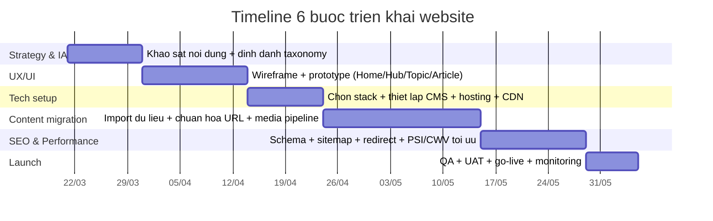

# Báo cáo phân tích website phapmontamlinh.vn làm mẫu xây dựng “Pháp Môn Tâm Linh Việt Nam”

## Executive summary

Website phapmontamlinh.vn là một cổng nội dung tiếng Việt (kèm nhiều đoạn song ngữ Việt–Hoa) tập trung vào việc giới thiệu, hướng dẫn tu học và tra cứu theo chủ đề của “Pháp Môn Tâm Linh (心灵法门)”, nổi bật với cấu trúc “Năm Đại Pháp Bảo” (Niệm Kinh, Phát nguyện, Phóng sinh, Đọc Bạch Thoại Phật Pháp, Đại Sám Hối). citeturn42search3turn26view4

Về nền tảng, website thể hiện dấu hiệu rất rõ của WordPress (thư mục `/wp-content/uploads/` trong URL ảnh). citeturn15view0turn15view1turn15view2 Kiến trúc thông tin hiện tại chia thành các “hub” hướng dẫn (Kinh Bài Tập, Ngôi Nhà Nhỏ), khối “Tra Cứu” gồm 30 trang chủ đề mức 1 (ví dụ: Ăn chay, Bệnh tật, Giấc mơ…), một khu riêng cho BHFF (Bạch Thoại Phật Pháp) với phân nhánh “Đọc/Nghe”, cùng hệ thống blog/archives theo tác giả và chuyên mục. citeturn34view0turn51view1turn22view0turn47view0

Điểm mạnh chính là “độ phủ nội dung” và trải nghiệm điều hướng nội bộ dày đặc (menu đa tầng lặp lại trên nhiều trang) giúp người dùng đi từ hướng dẫn tổng quan sang tra cứu chủ đề nhanh. citeturn34view0turn36view0turn37view0 Điểm yếu chính (để rút kinh nghiệm khi làm site mới) là sự phân tán IA (có ít nhất hai “hệ menu” khác nhau giữa cụm trang hướng dẫn/tra cứu và cụm blog), một số URL chứa ký tự tiếng Việt dạng percent-encoding (khó đọc/khó chuẩn hóa SEO), và nhiều thông tin kỹ thuật SEO (meta description/canonical/schema/robots/sitemap) không thể xác minh ổn định trong phiên phân tích này. citeturn31view0turn39view0turn23search3turn33view0

Bộ khuyến nghị cho website “Pháp Môn Tâm Linh Việt Nam” nên tái cấu trúc theo “content hub + taxonomy rõ ràng”, chuẩn hóa URL ASCII, định nghĩa lại template trang (Home/Hub/Topic/Article/Audio-Video/Library), bổ sung dữ liệu có cấu trúc (schema, breadcrumb, FAQ), và thiết lập pipeline đo hiệu năng theo Core Web Vitals (LCP/CLS/INP). citeturn17view0turn16search3turn51view1

## Phạm vi, phương pháp thu thập và giới hạn

Phạm vi phân tích dựa trên các URL công khai có thể truy cập thông qua: (a) điều hướng nội bộ từ các trang hub (Tra Cứu, Kinh Bài Tập, Ngôi Nhà Nhỏ, BHFF), (b) các trang archive WordPress (tác giả/chuyên mục), và (c) kết quả lập chỉ mục công khai (snippet) để đối chiếu sự tồn tại của một số URL và nội dung chính. citeturn34view0turn22view0turn47view0turn50search0

Giới hạn quan trọng: trong quá trình truy cập một số URL, hệ thống thu thập gặp lỗi liên quan kiểm tra robots.txt/timeout, dẫn tới không thể đảm bảo thu thập “toàn bộ URL công khai” theo nghĩa crawl 100% tất cả trang con (đặc biệt là các nhánh có thể chỉ được liên kết sâu, hoặc không nằm trong điều hướng). Ví dụ: một số lần mở URL báo lỗi “Error checking robots.txt…” hoặc timeout. citeturn33view0turn38view0turn45view0turn45view1 Vì vậy, mọi thông tin không xác định được một cách chắc chắn sẽ được ghi “không xác định” đúng theo yêu cầu.

## Cấu trúc menu, sitemap hiện tại và liên kết nội bộ

Cụm trang hướng dẫn/tra cứu (khác với cụm Blog) dùng một menu đa tầng kiểu “Close/Open” và lặp lại trên hầu hết trang trong cụm này, gồm các khối chính: Kinh Bài Tập, Ngôi Nhà Nhỏ, Tra Cứu (Danh mục tra cứu 30 mục), và BHFF (Home/Đọc/Nghe). citeturn34view0turn51view1turn29view0 Trong đó, trang `Tra Cứu` đóng vai trò hub điều hướng, hiển thị đầy đủ cây danh mục và liên kết nhanh sang các nhánh hướng dẫn khác. citeturn34view0

“Danh mục tra cứu” hiện tại là một danh sách 30 trang chủ đề cấp 1 (mỗi chủ đề là một URL riêng), ví dụ: `/an-chay/`, `/benh-tat/`, `/giac-mo/`, `/hoc-tap/`, `/phong-thuy/`, `/thang-van-khuyen-dao/`… Các chủ đề này được liệt kê rõ ràng trong menu và trong hub danh mục. citeturn34view0turn51view1

Về breadcrumb: trên các trang thuộc cụm hướng dẫn/tra cứu, không thấy breadcrumb dạng “Home > … > …” hiển thị xuyên suốt; thay vào đó có các khối điều hướng nội bộ và footer link. Riêng trong cụm BHFF, có một khối điều hướng dạng “1. Home (BHFF) / 2. Đọc / 3. Nghe” xuất hiện như breadcrumb/sidenav chuyên biệt. citeturn51view1turn26view2

Liên kết nội bộ được triển khai dày đặc dưới dạng: (a) menu lặp lại trên mọi trang hub, (b) liên kết “Mục lục (Truy cập)” trong các bài hướng dẫn, và (c) “Điều hướng bài viết” kiểu trước/sau trên một số trang chủ đề (ví dụ trang “câu cá” có “Trước đó” và “Kế tiếp”). citeturn29view0turn45view4

Sitemap ở góc nhìn “cây thư mục” (tổng hợp từ điều hướng đã truy cập) có thể mô tả như sau (một số nhánh bài viết rất lớn nên ghi theo pattern):

```text
/
├─ /blog/
│  ├─ /category/<slug>/
│  ├─ /author/adminphapmontamlinh/ (phân trang 1..33)
│  └─ /<bai-viet>/
├─ /kinh-bai-tap/
│  ├─ /huong-dan-niem-kinh/
│  ├─ /quy-trinh-dang-huong/
│  ├─ /y-nghia-kinh-van/
│  ├─ /dang-huong-ban-tho-phat-phap-mon-tam-linh/
│  ├─ /thap-tam-huong/
│  └─ /tai-ve-kinh-bai-tap/
├─ /ngoi-nha-nho/
│  ├─ /ngoi-nha-nho-va-hieu-dung-cua-ngoi-nha-nho/
│  ├─ /nhung-phat-cu-can-thiet-khi-niem-ngoi-nha-nho/
│  ├─ /mot-so-luu-y-truoc-khi-niem-ngoi-nha-nho/
│  ├─ /trinh-tu-cac-buoc-khi-niem-ngoi-nha-nho/
│  ├─ /quy-trinh-dot-ngoi-nha-nho/
│  ├─ /nhung-dieu-can-luu-y-khi-dot-ngoi-nha-nho/
│  ├─ /cach-bao-quan-ngoi-nha-nho/
│  ├─ /cach-huy-bo-ngoi-nha-nho/
│  ├─ /cach-cham-cham-do-vao-ngoi-nha-nho/
│  ├─ /tham-khao-so-luong-ngoi-nha-nho-cho-cac-tinh-huong/
│  ├─ /hoi-dap-ve-ngoi-nha-nho/
│  └─ /in-an-ngoi-nha-nho/
├─ /tra-cuu/
│  ├─ /danh-muc-tra-cuu/
│  └─ 30 chủ đề: /an-chay/, /ban-tho-phat-nho/, ... /thang-van-khuyen-dao/
├─ /bach-thoai-phat-phap/
│  ├─ /doc-bach-thoai-phat-phap/
│  ├─ /nghe-bach-thoai-phat-phap/
│  ├─ /bac-thoai-phat-phap-quyen-2-video-bai-giang/
│  ├─ /bac-thoai-phat-phap-quyen-4-video-bai-giang/
│  └─ /bạch-thoại-phật-pháp/đọc-bạch-thoại-phật-pháp/quyển-...-tập-... (nhiều URL)
├─ /kinh-sach/ ; /kinh-sach-phap-mon-tam-linh/ ; /sach-kinh/
├─ /phat-nguyen/ ; /dai-sam-hoi/
└─ Các trang khác: /gioi-thieu-phap-mon-tam-linh/ ; /tai-xuong/ ; /gioi-thieu/ ; /tai-ve/ ; /video-do-dang/
```

Các nhánh trên được xác nhận qua điều hướng và nội dung hiển thị của từng hub (Kinh Bài Tập, Ngôi Nhà Nhỏ, Tra Cứu, BHFF) và qua phân trang tác giả. citeturn34view0turn29view0turn37view0turn51view1turn22view0

## Phân tích theo nhóm trang và mẫu trang

Phần này mô tả “mẫu” theo nhóm trang (template/content type). Các trường không truy xuất chắc chắn (meta description, canonical, schema…) ghi “không xác định”.

Trang chủ `https://phapmontamlinh.vn/` nhấn mạnh “5 Đại Pháp Bảo” và đóng vai trò landing page dẫn về các hub hướng dẫn và tra cứu; trong snippet công khai thể hiện rõ cụm “Gồm Năm Đại Pháp Bảo…” và có nhúng video YouTube (nhưng snippet cũng cho thấy khả năng lỗi player). citeturn42search3 Media tiêu biểu trên trang chủ gồm ảnh trong thư mục WordPress uploads, định dạng PNG/JPG (kích thước: không xác định). citeturn15view0turn15view1

Nhóm hub “Kinh Bài Tập” (`/kinh-bai-tap/`) có cấu trúc rõ: phần “Mục lục (Truy cập)” dẫn tới các mục con (Hướng dẫn, Quy trình dâng hương, Ý nghĩa kinh văn, Lưu ý) và một khối “Download” trỏ ra Google Drive (PDF/tài liệu). citeturn29view0turn29view1 Ví dụ đoạn nội dung hướng dẫn có khuyến nghị thời gian không nên niệm kinh từ 2–5 giờ sáng. citeturn29view0 Trích đoạn mẫu (≤25 từ) để làm mẫu tone nội dung: “tốt nhất là không nên niệm Kinh… từ 2 giờ sáng đến 5 giờ sáng.” citeturn29view0

Nhóm hub “Ngôi Nhà Nhỏ” (`/ngoi-nha-nho/`) hoạt động như một “trang cổng” liệt kê hàng loạt bài hướng dẫn (ít nhất 13 mục) với liên kết chi tiết: hiệu dụng, vật dụng, lưu ý, trình tự, quy trình đốt, bảo quản, hủy bỏ, hỏi đáp, in ấn… citeturn26view0turn37view0turn37view11 Đây là mô hình content hub tốt để tái sử dụng cho site mới: một trang tổng quan → các sub-guide có nhiệm vụ cụ thể.

Nhóm hub “Tra Cứu” (`/tra-cuu/`, `/danh-muc-tra-cuu/`) là danh mục 30 chủ đề. Mỗi chủ đề là một trang cấp 1, thường có cấu trúc: H1 là tên chủ đề, bên dưới là “Mục lục tra cứu” và nội dung dạng hỏi–đáp/trích dẫn khai thị. Ví dụ trang `tết trung thu` hiển thị mục lục và một Q&A cụ thể. citeturn39view4 Ví dụ trang `câu cá` có thông điệp chính “Câu cá không phải là bộ môn thể thao”, kèm phần hỏi/đáp và điều hướng trước/sau. citeturn45view4

Nhóm “BHFF” (`/bach-thoai-phat-phap/`, `/doc-bach-thoai-phat-phap/`, `/nghe-bach-thoai-phat-phap/`) có phân nhánh đọc/nghe, và trong trang “Đọc” có danh sách nhiều “quyển” (bộ 4 quyển video và bộ 12 quyển). citeturn51view1turn26view6turn38view1 Một điểm kỹ thuật đáng lưu ý: có URL BHFF chứa ký tự tiếng Việt dạng percent-encoding (ví dụ đường dẫn “quyển-2-tập-08”), nên trong site mới cần chuẩn hóa URL để đồng nhất, dễ đọc và dễ chia sẻ. citeturn23search3

Nhóm “Thư viện/Kinh sách” (`/kinh-sach/`, `/kinh-sach-phap-mon-tam-linh/`) có dạng catalog: mỗi mục sách có ảnh đại diện (“Image”) và liên kết “Đọc Online”/“Download Ebook” (nhiều liên kết trỏ Google Drive). citeturn26view2turn26view3 Trích đoạn mẫu (≤25 từ) thể hiện guideline biên tập: “Kinh Phật là Pháp bảo… nên phải cung kính tôn trọng…” citeturn26view3

Nhóm “Blog/Article” có ít nhất hai kiểu: (a) trang blog tổng hợp (`/blog/`) hiển thị bài mới và số bình luận (nhiều mục = 0), citeturn50search0 (b) trang bài viết đầy đủ có H1 dài, có điều hướng bài viết trước/sau. Ví dụ bài “100. Về việc làm sao để bày tỏ lòng biết ơn Quán Thế Âm Bồ Tát…” hiển thị H1/H2, danh sách trả lời theo bullet, và điều hướng “Trước đó/Kế tiếp”. citeturn30search3 Ở mô hình category archive (`/category/...`) có “Read More” và trạng thái “Không có bình luận”. citeturn47view0

Nhóm “Phát nguyện/Đại sám hối/Chủ đề thực hành” là các trang hướng dẫn riêng: `phat-nguyen` giải thích khái niệm phát nguyện và vai trò trong 5 pháp bảo, citeturn26view7 trong khi `dai-sam-hoi` đưa ra quy tắc số biến/giới hạn theo ngày. citeturn26view8

## Phân tích SEO on-page, UX/UI và kỹ thuật

Về SEO on-page: hệ thống tiêu đề trang (title hiển thị) nhất quán theo mẫu “<Tên trang> - Pháp Môn Tâm Linh (心灵法门)” trên nhiều URL, hỗ trợ nhận diện thương hiệu. citeturn39view3turn39view2turn46view0 Cấu trúc heading trong nội dung thường dùng H1 cho tiêu đề trang và H2/H3 cho mục lục/tiểu mục (ví dụ `Kinh Bài Tập` có các khối (1)(2)(3)(4) và “Mục lục”, còn `Học tập` có “Mục lục tra cứu” và các heading theo số). citeturn29view0turn46view0 Tuy nhiên, không thể xác định meta description/canonical/alt ảnh/schema markup trong phiên này ⇒ ghi “không xác định” cho các mục đó.

Về cấu trúc URL: đa số URL là slug ASCII có gạch nối (tốt), nhưng vẫn tồn tại đường dẫn có ký tự tiếng Việt mã hóa (percent-encoding) trong nhánh BHFF—đây là rủi ro cho chuẩn hóa SEO và UX chia sẻ link. citeturn23search3 Ngoài ra, có dấu hiệu không đồng nhất slug ở một số trang BHFF (“bac-thoai…” thay vì “bach-thoai…”), dễ gây lỗi chuẩn hóa/redirect trong hệ thống mới. citeturn38view1

Về UX/UI: do giới hạn truy cập dạng text-only, các yếu tố màu sắc/font/spacing/responsive chỉ đánh giá được ở mức “không xác định”. Điểm chắc chắn quan sát được là website dùng menu đa tầng với trạng thái “Close/Open”, nhiều khả năng hỗ trợ mobile (hamburger/accordion menu). citeturn34view0turn39view0 CTA hiện diện dưới dạng “Download” trỏ Google Drive trong các hub hướng dẫn. citeturn29view0turn26view1

Về kỹ thuật/CMS: có bằng chứng WordPress thông qua tài nguyên media nằm trong `/wp-content/uploads/...` (ảnh PNG/JPG). citeturn15view0turn15view1 Các file tải xuống sử dụng dịch vụ bên ngoài như Google Drive và Jumpshare (mẫu in), nghĩa là luồng tài liệu phụ thuộc third-party storage. citeturn29view0turn45view5

Các tệp kỹ thuật nền tảng như `robots.txt`, `sitemap.xml`, header response, hay báo cáo hiệu năng LCP/CLS/INP cho chính phapmontamlinh.vn đều “không xác định” trong phiên này do xuất hiện lỗi kiểm tra robots/timeout khi truy cập một số URL. citeturn33view0turn45view0turn45view1 Dù vậy, để triển khai site mới, cần đo hiệu năng theo Core Web Vitals; chuẩn tham khảo phổ biến: LCP tốt khi ≤ 2.5s, CLS tốt khi ≤ 0.1, và INP mục tiêu khoảng ≤ 200ms (ngưỡng “good” theo hướng dẫn web.dev qua công cụ tổng hợp). citeturn17view0 PageSpeed Insights được Google mô tả là công cụ báo cáo trải nghiệm người dùng (mobile/desktop) và đưa ra đề xuất tối ưu. citeturn16search3

Về dữ liệu có cấu trúc (content inventory): hệ thống có trang tác giả `adminphapmontamlinh` và phân trang tới trang 33, cho thấy số lượng bài viết tối thiểu đủ lớn (ước tính vài trăm bài nếu mỗi trang liệt kê nhiều post). citeturn22view0 Ngoài tác giả này còn có tác giả khác như “Đinh Thị Thu Huyền” xuất hiện trong category archive. citeturn49view0 Bình luận: nhiều nơi hiển thị “Không có bình luận” hoặc số bình luận = 0 trên danh sách bài. citeturn47view0turn50search0

## Đề xuất cấu trúc website mới, taxonomy, template và checklist dữ liệu

Định hướng IA cho website “Pháp Môn Tâm Linh Việt Nam” nên giữ tinh thần “content hub” của site hiện tại (rất phù hợp với nhu cầu hướng dẫn/tu học), nhưng cần hợp nhất hệ menu, chuẩn hóa taxonomy và URL. Trọng tâm là: **một hệ điều hướng thống nhất** cho cả “Hướng dẫn – Tra cứu – Thư viện – Blog – Media – Cộng tu”.

Mermaid sitemap đề xuất (khuyến nghị URL ASCII, không dùng dấu, không percent-encoding):

```mermaid
flowchart TD
  A[Home] --> B[Bat dau / Onboarding]
  A --> C[Huong dan tu hoc]
  A --> D[Tra cuu]
  A --> E[Thu vien]
  A --> F[Bai viet]
  A --> G[Video - Audio]
  A --> H[Cong tu & Ket noi]
  A --> I[Lien he]
  A --> J[Chinh sach]

  B --> B1[PMTL la gi]
  B --> B2[5 Dai Phap Bao]
  B --> B3[FAQ cho nguoi moi]

  C --> C1[Niem kinh]
  C --> C2[Phat nguyen]
  C --> C3[Phong sinh]
  C --> C4[Dai sam hoi]
  C --> C5[Bach Thoai Phat Phap]
  C1 --> C1a[Kinh bai tap]
  C1 --> C1b[Tu tu kinh van]
  C2 --> C2a[Mau phat nguyen]
  C4 --> C4a[Huong dan so bien / gioi han]
  C5 --> C5a[Doc]
  C5 --> C5b[Nghe]

  D --> D1[Chu de]
  D --> D2[Tim kiem nang cao]
  D1 --> D1a[30 chu de hien co]
  D1 --> D1b[Chu de moi de mo rong]

  E --> E1[Kinh sach - Ebook]
  E --> E2[Audio sach noi]
  E --> E3[Tai lieu in an]
  E --> E4[Downloads (noi bo, co version)]

  F --> F1[Chuyen muc]
  F --> F2[Tags]
  F --> F3[Tac gia]
  F --> F4[Archive theo nam]

  G --> G1[Playlist theo chu de]
  G --> G2[Podcast / Bai giang]
  G --> G3[Video do dang]

  H --> H1[Huong dan phung su]
  H --> H2[Zalo / MXH]
  H --> H3[Su kien / Lich]
```

Bảng so sánh sitemap hiện tại vs đề xuất (tóm lược cấp cao):

| Khía cạnh | Hiện tại (phapmontamlinh.vn) | Đề xuất site mới |
|---|---|---|
| Điều hướng | Ít nhất 2 hệ menu: cụm hub hướng dẫn/tra cứu và cụm blog (Home/Blog/Video/About/Download). citeturn31view0turn34view0 | 1 hệ menu thống nhất, phân nhóm rõ: Onboarding – Hướng dẫn – Tra cứu – Thư viện – Blog – Media – Cộng tu. |
| Tra cứu chủ đề | 30 trang chủ đề cấp 1 (mỗi chủ đề là 1 URL). citeturn34view0turn51view1 | Giữ 30 chủ đề nhưng triển khai như taxonomy (Category/Topic) + landing page cho từng topic, có filter theo loại nguồn (wenda/zongshu/thu…). |
| BHFF | Có nhánh Đọc/Nghe và danh sách quyển; tồn tại URL percent-encoding cho tập/quyển. citeturn51view1turn23search3 | Chuẩn hóa URL ASCII (vd: `/bhff/quyen-2/tap-08/`), triển khai breadcrumb + schema, phân trang + tìm kiếm theo quyển/tập. |
| Thư viện | Link out Google Drive/Jumpshare khá nhiều. citeturn29view0turn45view5turn26view2 | Thư viện nội bộ có versioning, metadata (file type/size/ngày cập nhật), mirror storage (S3/R2) để giảm phụ thuộc. |
| Blog/Archive | Có category/tác giả phân trang tới 33 trang. citeturn22view0turn47view0 | Giữ archive nhưng thêm tag, author page chuẩn, sitemap XML, và bộ lọc nâng cao + liên kết “Related by topic”. |
| SEO kỹ thuật | Không xác định được canonical/schema/sitemap/robots trong phiên này; có lỗi check robots ở một số URL. citeturn33view0turn45view0turn45view1 | Thiết lập rõ: robots.txt, sitemap.xml, canonical, schema (Article/Breadcrumb/FAQ), redirect map và monitoring. |

Template trang khuyến nghị (mẫu bắt buộc khi xây site mới):

- Home: hero + entry points (5 pháp bảo, tra cứu chủ đề, thư viện, bài mới), search nổi bật.
- Hub page (Onboarding / Kinh Bài Tập / Ngôi Nhà Nhỏ / BHFF / Thư viện): có mô tả ngắn, CTA rõ, mục lục, liên kết subpages.
- Topic landing (ví dụ “Ăn chay”): mô tả, mục lục, filter theo loại nội dung, danh sách bài theo độ liên quan.
- Article page: H1, breadcrumb, TOC tự động, khối trích dẫn/nguồn, related posts, prev/next, schema Article.
- Author page: bio + list bài + filter theo topic.
- Contact page: form + MXH + thông tin nhóm.
- Download/Library item page: metadata file, version, file hash (tuỳ chọn), hướng dẫn sử dụng.

Checklist dữ liệu cần thu thập/chuẩn hóa (để nhập liệu & SEO):

- Nội dung: ID bài, tiêu đề, tóm tắt, nội dung, nguồn (wenda/zongshu/thu giải đáp…), ngày, người dịch/biên tập, ngôn ngữ (vi/zh), chủ đề (topic), chuyên mục (category), tag (thần chú/kinh), liên kết tài liệu liên quan.
- SEO: slug ASCII, meta title, meta description, canonical, OG/Twitter cards, schema (Article/FAQ/Breadcrumb), liên kết nội bộ (related), anchor text.
- Media: URL file, nội dung alt, caption, định dạng, kích thước file, kích thước ảnh, bản mobile (srcset), license/nguồn.
- Kỹ thuật: status code, redirect map, sitemap.xml, robots.txt, monitoring Core Web Vitals (LCP/CLS/INP) theo chuẩn. citeturn17view0turn16search3

Timeline triển khai 6 bước (khuyến nghị):



## Phụ lục URL, file output và ghi chú “không xác định”

File output đã tạo (gồm danh sách URL đã phát hiện + metadata mức cơ bản; trường không truy xuất chắc chắn được ghi “không xác định”):

- CSV: [Download](sandbox:/mnt/data/phapmontamlinhvn_urls_metadata.csv)  
- JSON: [Download](sandbox:/mnt/data/phapmontamlinhvn_urls_metadata.json)

Tập dữ liệu hiện bao gồm 111 URL (các hub chính, 30 trang tra cứu, các trang hướng dẫn con, BHFF, thư viện, archives và phân trang tác giả 1..33 suy diễn). Nguồn xác thực phân trang tác giả đến “33” dựa trên hiển thị “Phân trang bài đăng … 1 … 33”. citeturn22view0

Các mục kỹ thuật sau không xác định được ổn định trong phiên này: robots.txt nội dung cụ thể, sitemap.xml/sitemap_index.xml, canonical tags, schema markup, server headers, và các chỉ số LCP/CLS/INP cho chính phapmontamlinh.vn (một số URL gặp lỗi robots/timeout). citeturn33view0turn45view0turn45view1