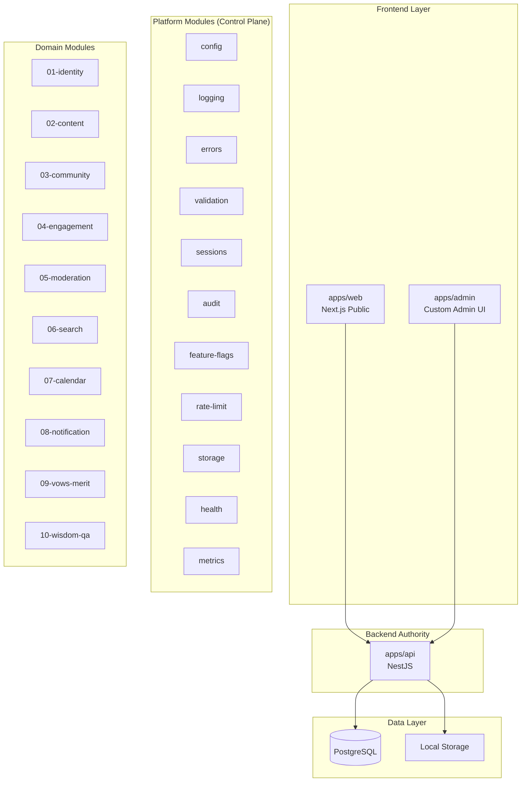

# 🔍 AUDIT BÁO CÁO: Thư mục `design/` — PMTL_VN

> **Status note (Ghi chú trạng thái)**: Đây là snapshot audit tại thời điểm 2026-03-20. Một phần đề xuất trong file này đã được áp dụng sau đó: `overview/`, `baseline/`, `ops/`, `tracking/`, domain renumbering `01-10`, và việc dời `infra-deep-dive` sang `docs/ops/`. Khi audit khác tree hiện tại, ưu tiên tree thật trong repo.

> **Người đánh giá**: Senior Full-stack Engineer (10+ năm kinh nghiệm)
> **Ngày**: 2026-03-20
> **Phạm vi**: Toàn bộ `design/` — 20 root files, 12 subdirectories
> **Tiêu chí**: Trùng lặp, thừa, phi lý, thiếu, nhất quán

---

## 📊 ĐIỂM SỐ TỔNG QUAN

| Tiêu chí | Điểm (1-10) | Nhận xét |
|---|---|---|
| **Cấu trúc tổ chức** | 7/10 | Module numbering rõ, nhưng root quá nhiều file lẻ |
| **Tính nhất quán** | 5/10 | Rất nhiều nội dung trùng lặp giữa các file root |
| **Tính thực dụng** | 6/10 | Viết kỹ nhưng quá dài, chưa có code nào — dễ thành "ảo giác an toàn" |
| **Tính đầy đủ** | 8/10 | Các domain module đều có 5-file pattern tốt |
| **Tỉ lệ tín hiệu/nhiễu** | 4/10 | Quá nhiều lặp lại cùng 1 ý ở 5-6 file khác nhau |
| **Khả năng bảo trì** | 4/10 | Sửa 1 chính sách phải cập nhật 4-5 file |

> **Điểm tổng: 5.7/10** — Thiết kế tốt về chiều sâu, nhưng **béo phì về chiều rộng**. Cần giảm cân gấp.

---

## 🔴 VẤN ĐỀ NGHIÊM TRỌNG: TRÙNG LẶP MẤT KIỂM SOÁT

Đây là vấn đề **số 1** của thư mục `design/`. Cùng một chính sách được lặp đi lặp lại ở **4-6 file khác nhau**, tạo ra rủi ro sai lệch khi cập nhật.

### Bảng trùng lặp cụ thể

| Chính sách | Số file lặp | Các file chứa |
|---|---|---|
| **"Postgres là source of truth"** | 6 | `CORE_DECISIONS`, `ARCHITECTURE_GOVERNANCE`, `architecture-principles`, `INFRA`, `INFRA_DEEP_DIVE`, `MODULE_INTERACTIONS` |
| **"NestJS là auth authority duy nhất"** | 5 | `CORE_DECISIONS`, `ARCHITECTURE_GOVERNANCE`, `architecture-principles`, `SECURITY_BASELINE`, `INFRA` |
| **"Valkey/Meilisearch/BullMQ chỉ bật khi có pain"** | 6 | `README`, `CORE_DECISIONS`, `ARCHITECTURE_GOVERNANCE`, `INFRA`, `INFRA_DEEP_DIVE`, `PLATFORM_MODULES_BASELINE` |
| **"Phase 1 baseline stack"** | 5 | `README`, `ARCHITECTURE_GOVERNANCE`, `INFRA`, `INFRA_DEEP_DIVE`, `ROADMAP` |
| **"Status semantics (implemented/planned/...)"** | 3 | `README`, `ARCHITECTURE_GOVERNANCE`, `IMPLEMENTATION_MAPPING` |
| **"Storage abstraction + local adapter"** | 5 | `CORE_DECISIONS`, `ARCHITECTURE_GOVERNANCE`, `PLATFORM_MODULES_BASELINE`, `INFRA`, `INFRA_DEEP_DIVE` |
| **"Rate limit bắt buộc cho auth/search/upload"** | 4 | `CORE_DECISIONS`, `ARCHITECTURE_GOVERNANCE`, `SECURITY_BASELINE`, `INFRA` |
| **"Health endpoints /health/*"** | 4 | `ARCHITECTURE_GOVERNANCE`, `PLATFORM_MODULES_BASELINE`, `INFRA`, `SLA_SLO` |
| **"Backup/restore drill"** | 4 | `ARCHITECTURE_GOVERNANCE`, `BACKUP_RESTORE_RUNBOOK`, `INFRA`, `RESTORE_DRILL_LOG` |
| **"Upload hardening rules"** | 4 | `CORE_DECISIONS`, `ARCHITECTURE_GOVERNANCE`, `SECURITY_BASELINE`, `INFRA` |
| **"Request pipeline NestJS"** | 2 | `NEST_APPLICATION_BASELINE`, `ARCHITECTURE_GOVERNANCE` |
| **"Audit log events"** | 2 | `AUDIT_POLICY`, `SECURITY_BASELINE` |
| **"Boundary validation bằng Zod"** | 4 | `CORE_DECISIONS`, `ARCHITECTURE_GOVERNANCE`, `NEST_APPLICATION_BASELINE`, `INFRA` |

> [!CAUTION]
> **Hậu quả**: Khi anh thay đổi 1 chính sách (ví dụ: đổi access token TTL từ 15 phút → 30 phút), anh phải nhớ sửa ở **ít nhất 2-3 file**. Quên 1 file = docs tự mâu thuẫn chính nó.

---

## 🟡 VẤN ĐỀ VỪA: CÁC FILE THỪA HOẶC CÓ THỂ GOM

### 1. [INFRA.md](file:///c:/Users/ADMIN/DEV2/PMTL_VN/design/infra/INFRA.md) vs [INFRA_DEEP_DIVE.md](file:///c:/Users/ADMIN/DEV2/PMTL_VN/design/infra/INFRA_DEEP_DIVE.md) — **Quá béo, quá trùng**

| File | Kích thước | Vấn đề |
|---|---|---|
| [infra/INFRA.md](file:///c:/Users/ADMIN/DEV2/PMTL_VN/design/infra/INFRA.md) | 26,790 bytes (562 dòng) | Lặp lại 70% nội dung của `ARCHITECTURE_GOVERNANCE` |
| [infra/INFRA_DEEP_DIVE.md](file:///c:/Users/ADMIN/DEV2/PMTL_VN/design/infra/INFRA_DEEP_DIVE.md) | 31,734 bytes (978 dòng) | Phần lớn là hướng dẫn sử dụng Prometheus/Grafana/Redis Exporter — **không thuộc design/** |

**Phán xét**: [INFRA_DEEP_DIVE.md](file:///c:/Users/ADMIN/DEV2/PMTL_VN/design/infra/INFRA_DEEP_DIVE.md) nên chuyển ra `docs/learning/` hoặc `docs/ops/`. Nó là **tài liệu vận hành**, không phải **quyết định kiến trúc**. `INFRA.md` nên rút gọn còn ~150 dòng, chỉ giữ phần "khác biệt" so với `ARCHITECTURE_GOVERNANCE`.

### 2. `CORE_DECISIONS.md` vs `ARCHITECTURE_GOVERNANCE.md` — **Hai ông vua cùng ngai**

| File | Kích thước | Vai trò khai báo |
|---|---|---|
| `CORE_DECISIONS.md` | 42,351 bytes (538 dòng) | "Các quyết định cốt lõi" |
| `ARCHITECTURE_GOVERNANCE.md` | 39,060 bytes (559 dòng) | "Single source of truth cho cross-cutting rules" |

**Phán xét**: Cả hai file đều tự nhận mình là "nguồn sự thật". Đọc `ARCHITECTURE_GOVERNANCE` thấy nó lặp lại >60% nội dung của `CORE_DECISIONS` nhưng thêm bảng tooling status. **Nên gộp thành 1 file** hoặc tách rõ: `CORE_DECISIONS` = decision log (chỉ giữ context/rationale/trade-off), `ARCHITECTURE_GOVERNANCE` = operational rules dạng bảng ngắn gọn.

### 3. `EN_VI_NOTATION_RULES.md` vs `TERMINOLOGY_RULES.md` — **Có thể gộp**

- `EN_VI_NOTATION_RULES.md` (93 dòng): Cách viết `English (Việt)` 
- `TERMINOLOGY_RULES.md` (137 dòng): Bảng thuật ngữ chuẩn

Hai file này cùng phục vụ 1 mục đích: **đảm bảo nhất quán thuật ngữ**. Gộp thành `TERMINOLOGY.md` duy nhất.

### 4. `SOURCE_NOTES_OFFICIAL.md` vs `FEATURE_SURFACE_FROM_OFFICIAL_SITES.md` — **Trùng ~40%**

Cả hai đều liệt kê nguồn chính thức (`lujunhong2or.com`, `xlch.org`, `guanyincitta.com`) và rút ra kết luận thiết kế giống nhau. Nên **gộp lại 1 file**.

### 5. `CONTRACT_GUIDELINES.md` vs `USE_CASE_TEMPLATE.md` — **Có thể gộp**

- `CONTRACT_GUIDELINES` (70 dòng): Quy tắc viết contract 
- `USE_CASE_TEMPLATE` (121 dòng): Quy tắc viết use-case

Cả hai là **hướng dẫn viết tài liệu**, không phải quyết định kiến trúc. Gộp thành `WRITING_STANDARDS.md`.

### 6. `RESTORE_DRILL_LOG.md` — **File gần như rỗng**

Chỉ có template chưa điền. Không sai, nhưng nên chuyển ra `docs/ops/` vì đây là **log vận hành**, không phải thiết kế.

### 7. File `.dbdiagram` trùng với `.dbml`

Trong `00-identity/` và `01-content/`, `02-community/` có cả `schema.dbdiagram` lẫn `schema.dbml`. File `.dbdiagram` chỉ là bản thu gọn/export từ `.dbml` → **thừa, nên xóa 1**.

---

## 🟡 VẤN ĐỀ VỪA: CẤU TRÚC PHI LÝ

### 1. `00-identity/` và `00-overview/` cùng prefix `00-`

Prefix `00` gợi ý "meta/overview" nhưng `00-identity` là một **domain module thực thụ**. Gây nhầm lẫn. Nên đổi `00-identity` thành prefix riêng, hoặc đánh lại từ `01-` cho identity.

**Đề xuất**: 
```
overview/        ← không cần số, nó là meta
01-identity/
02-content/
...
```

### 2. `MODULE_INTERACTIONS.md` nằm ở root thay vì `00-overview/`

File này miêu tả **tương tác giữa các module** — rõ ràng thuộc lớp overview. Nên nằm trong `00-overview/`.

### 3. `AUDIT_POLICY.md` nằm ở root

File audit policy chi tiết theo từng module (Identity, Content, Community...) — nên nằm gần `SECURITY_BASELINE` hoặc tách vào từng module. Hiện tại nằm ở root nhưng không được `README.md` liệt kê trong "Read in order".

### 4. `ELDERLY_UX_RULES.md` — **Đúng ý nhưng sai chỗ**

File UX cho người lớn tuổi nên nằm ở `docs/ux/` hoặc trong `design/00-overview/`. Nằm ở root `design/` lạc lõng.

---

## 🔵 NHỮNG GÌ LÀM TỐT

| Điểm mạnh | Chi tiết |
|---|---|
| **5-file pattern per module** | Mỗi domain module (`01` → `09`) đều có `module-map`, `contracts`, `decisions`, `flows.mmd`, `schema.dbml`, `use-cases/` — rất chuẩn |
| **Phase discipline** | Chia rõ phase 1/2/3, có điều kiện bật cụ thể cho từng component — thực dụng cho sinh viên |
| **Anti-pattern warnings** | Mỗi file đều có "Không nên làm" / "Anti-goals" — rất hữu ích cho AI codegen |
| **Song ngữ AN-VI** | Mẫu `English (Việt)` giúp vừa học thuật ngữ vừa hiểu nghĩa — rất tốt cho dự án Việt Nam |
| **Implementation mapping** | File `IMPLEMENTATION_MAPPING.md` chặn "ảo giác hoàn thành" — ý tưởng tuyệt vời |
| **Restore drill log** | Template drill restore — kỷ luật vận hành nghiêm túc |
| **Five Treasures Model** | Map nghiệp vụ pháp môn vào module kỹ thuật — đúng context dự án |

---

## 🔴 NHỮNG GÌ THIẾU

### 1. **Thiếu: API Route Inventory**
Không có file nào liệt kê **đầy đủ tất cả route API** dự kiến. Mỗi module `contracts.md` có một ít, nhưng không có bản tổng hợp. Khi code NestJS, dev sẽ phải nhảy 10 file để biết hệ thống có bao nhiêu endpoint.

**Đề xuất**: Thêm `API_ROUTE_INVENTORY.md` hoặc dùng OpenAPI spec draft.

### 2. **Thiếu: Database Schema tổng hợp (ERD)**
Mỗi module có `schema.dbml` riêng nhưng **không có ERD tổng**. Relation giữa `users` ↔ `posts` ↔ `comments` ↔ `practiceSheets` phải tự lắp ghép.

**Đề xuất**: Thêm `design/FULL_ERD.dbml` hoặc diagram tổng hợp.

### 3. **Thiếu: Migration Strategy**
Dù nói nhiều về Prisma và migration, không có file nào chốt:
- Naming convention cho migration files
- Rollback strategy
- Data migration vs schema migration
- Seed data strategy

### 4. **Thiếu: Error Code Registry**
`NEST_APPLICATION_BASELINE.md` có error envelope format nhưng không có bảng mã lỗi đầy đủ. Ví dụ: `auth.invalid_credentials` được nhắc nhưng không có danh sách tất cả error codes.

### 5. **Thiếu: Environment Variables Inventory**
Nói rất nhiều về "env contract" và "Zod validation" nhưng **không có file nào liệt kê** tất cả biến môi trường cần thiết cho `apps/web`, `apps/api`, `apps/admin`.

### 6. **Thiếu: Deployment Procedure**
Có backup/restore runbook nhưng **không có deployment runbook**:
- Cách deploy lên VPS
- Cách rollback deployment
- Cách xử lý migration lỗi khi deploy
- Zero-downtime deployment (nếu cần)

### 7. **Thiếu: Testing Strategy**
Không có file nào chốt:
- Unit test coverage target
- Integration test cho API routes
- E2E test strategy
- Test data seeding

### 8. **Thiếu: Frontend Architecture Doc**
`apps/web` và `apps/admin` chỉ được nhắc qua trong `REPO_STRUCTURE_BASELINE`. Không có file nào chốt:
- State management strategy
- Data fetching pattern (RSC vs client)
- Caching strategy phía client
- Design system / component library decision

---

## 📋 ĐỀ XUẤT HÀNH ĐỘNG (Ưu tiên cao → thấp)

### Ưu tiên 1: Giảm trùng lặp (Quan trọng nhất!)

```
TRƯỚC:                          SAU:
├── README.md                   ├── README.md (rút gọn, chỉ là mục lục)
├── CORE_DECISIONS.md (538 dòng)├── DECISIONS.md (gộp decisions + governance, ~400 dòng)
├── ARCHITECTURE_GOVERNANCE.md  │   ← XÓA, gộp vào DECISIONS.md
├── PLATFORM_MODULES_BASELINE.md├── PLATFORM_MODULES.md (giữ, rút gọn)
├── NEST_APPLICATION_BASELINE.md├── NEST_BASELINE.md (giữ, rút gọn)
├── SECURITY_BASELINE.md        ├── SECURITY.md (giữ, rút gọn)
├── infra/INFRA.md (562 dòng)   ├── INFRA.md (rút gọn ~150 dòng, ref DECISIONS)
├── infra/INFRA_DEEP_DIVE.md    │   ← CHUYỂN ra docs/ops/
```

### Ưu tiên 2: Gộp file thừa

```
EN_VI_NOTATION_RULES.md + TERMINOLOGY_RULES.md → TERMINOLOGY.md
SOURCE_NOTES_OFFICIAL.md + FEATURE_SURFACE_FROM_OFFICIAL_SITES.md → SOURCE_ANALYSIS.md
CONTRACT_GUIDELINES.md + USE_CASE_TEMPLATE.md → WRITING_STANDARDS.md
```

### Ưu tiên 3: Bổ sung file thiếu

```
+ API_ROUTE_INVENTORY.md       (Danh sách route API dự kiến)
+ FULL_SCHEMA.dbml             (ERD tổng hợp)
+ ENV_INVENTORY.md             (Biến môi trường)  
+ ERROR_CODES.md               (Registry mã lỗi)
+ TESTING_STRATEGY.md          (Chiến lược kiểm thử)
+ DEPLOY_RUNBOOK.md            (Quy trình triển khai)
+ FRONTEND_ARCHITECTURE.md    (Kiến trúc frontend)
+ MIGRATION_STRATEGY.md        (Chiến lược di cư dữ liệu)
```

### Ưu tiên 4: Sắp xếp lại cấu trúc

```
design/
├── README.md                  ← Mục lục ngắn gọn
├── DECISIONS.md               ← Single source of truth cho mọi quyết định
├── overview/                  ← Bỏ prefix 00-, nó là meta
│   ├── domain-map.md
│   ├── execution-map.md
│   ├── architecture-principles.md
│   ├── five-treasures.md
│   ├── source-analysis.md     ← Gộp 2 file nguồn
│   ├── roadmap.md
│   └── terminology.md         ← Gộp 2 file thuật ngữ
├── baseline/                  ← Gom các file nền tảng kỹ thuật
│   ├── platform-modules.md
│   ├── nest-baseline.md
│   ├── repo-structure.md
│   ├── security.md
│   ├── infra.md
│   ├── sla-slo.md
│   ├── failure-modes.md
│   └── writing-standards.md   ← Gộp contract + use-case template
├── ops/                       ← Tài liệu vận hành
│   ├── backup-restore.md
│   ├── restore-drill-log.md
│   ├── deploy-runbook.md
│   └── elderly-ux.md
├── tracking/                  ← Theo dõi tiến độ
│   ├── implementation-mapping.md
│   ├── module-interactions.md
│   ├── audit-policy.md
│   └── env-inventory.md
├── 01-identity/
├── 02-content/
├── 03-community/
├── 04-engagement/
├── 05-moderation/
├── 06-search/
├── 07-calendar/
├── 08-notification/
├── 09-vows-merit/
├── 10-wisdom-qa/
```

---

## 📊 TỔNG KẾT MODULE

### Tổng quan hệ thống (System Overview)



### Map từng module — Vai trò và trạng thái

| # | Module | Vai trò | Owns | Trạng thái design |
|---|---|---|---|---|
| P1 | `config` | Env contract, startup validation | env schema | ✅ Defined |
| P2 | `logging` | Pino bootstrap, request context | log format | ✅ Defined |
| P3 | `errors` | Global exception filter, error envelope | error codes | ⚠️ Thiếu error code registry |
| P4 | `validation` | Zod validation pipe | schemas | ✅ Defined |
| P5 | `sessions` | Refresh token, revoke | session records | ✅ Defined |
| P6 | `audit` | Append-only audit log | audit_logs | ✅ Defined (có AUDIT_POLICY) |
| P7 | `feature-flags` | isFeatureEnabled(key) | feature_flags | ✅ Defined |
| P8 | `rate-limit` | IP/account scoped guard | rate_limit_records | ✅ Defined |
| P9 | `storage` | Upload abstraction, local adapter | media_assets | ✅ Defined |
| P10 | `health` | /health/live,ready,startup | health endpoints | ✅ Defined |
| P11 | `metrics` | /metrics, counters, histogram | metrics | ✅ Defined |
| 01 | `identity` | Users, auth, sessions, roles | users, auth | ✅ Có use-cases + schema |
| 02 | `content` | Editorial, taxonomy, scripture, chant | posts, sutras, guides | ✅ Đầy đủ nhất |
| 03 | `community` | Comments, posts, guestbook | UGC entities | ✅ Có use-cases + schema |
| 04 | `engagement` | Bookmarks, progress, practice | self-owned state | ✅ Có use-cases + schema |
| 05 | `moderation` | Reports, decisions | moderationReports | ✅ Có use-cases + schema |
| 06 | `search` | Index, query, fallback | search contracts | ✅ Có use-cases |
| 07 | `calendar` | Events, lunar, personal calendar | events, lunar | ✅ Đầy đủ + read models |
| 08 | `notification` | Push, email dispatch | pushJobs, subs | ✅ Có use-cases |
| 09 | `vows-merit` | Vows, life release | vows, journal | ✅ Có use-cases + schema |
| 10 | `wisdom-qa` | Bạch thoại, hỏi đáp, offline | entries, bundles | ✅ Đầy đủ + ingestion plan |

---

## 🎯 KẾT LUẬN CUỐI

### Điểm mạnh cần giữ:
1. **Domain modeling** xuất sắc — 10 module rõ ràng, mỗi module có ownership rõ
2. **Phase discipline** — không over-engineer, biết khi nào bật cái gì
3. **Security-first mindset** — cookie flags, CSRF, upload hardening đều được chốt cụ thể
4. **Anti-pattern documentation** — mỗi file đều có "không được làm"

### Điểm yếu cần sửa ngay:
1. **Trùng lặp mất kiểm soát** — Cùng 1 chính sách xuất hiện 4-6 chỗ → khó maintain
2. **Tỉ lệ tín hiệu/nhiễu thấp** — Đọc 200+ trang nhưng chỉ ~40% là thông tin mới
3. **Chưa có code nào** — Toàn bộ là "target design" → rủi ro "paper architecture"
4. **Thiếu tài liệu thực hành** — Không có route inventory, ERD tổng, env list, error codes

### Lời khuyên cho sinh viên ít tiền:
- **Đừng viết thêm docs nữa** — Đã đủ rồi, thậm chí dư
- **Bắt đầu code** — Chọn `apps/api` baseline → `identity` module → `content` module
- **Giảm cân docs** — Gộp file trùng, chuyển INFRA_DEEP_DIVE ra `docs/ops/`
- **Tất cả free**: Postgres ✅, NestJS ✅, Prisma ✅, Caddy ✅, Pino ✅, Zod ✅, Cloudflare free tier ✅
