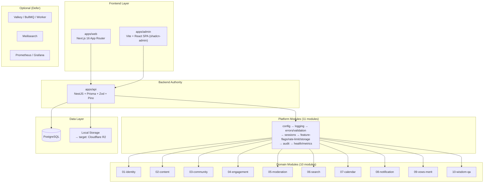

# 🔬 AUDIT TOÀN DIỆN THƯ MỤC `design/` — PMTL_VN

> **Người đánh giá**: Senior Full-stack Engineer (10+ năm kinh nghiệm)
> **Ngày**: 2026-03-20
> **Phạm vi**: 70 files, 15 thư mục con
> **Tiêu chí**: Trùng lặp, thừa, phi lý, thiếu, chấm điểm toàn diện

---

## 📊 ĐIỂM SỐ TỔNG QUAN

| Tiêu chí | Điểm | Nhận xét |
|---|---|---|
| **Cấu trúc tổ chức** | 8/10 | Module numbering 01-10 rõ, phân tầng `overview/baseline/tracking/ops/ui` hợp lý |
| **Tính nhất quán** | 6/10 | Đã cải thiện so với audit trước (5/10), nhưng vẫn còn trùng lặp ý giữa root docs |
| **Tính thực dụng** | 7/10 | Viết rất kỹ, phase discipline tốt, coding-readiness chi tiết |
| **Tính đầy đủ** | 8.5/10 | Domain modules đầy đủ, frontend arch đã bổ sung, UI/UX 5 docs |
| **Tỉ lệ tín hiệu/nhiễu** | 5/10 | Vẫn lặp cùng 1 policy ở 3-4 file. [infra.md](file:///C:/Users/ADMIN/DEV2/PMTL_VN/design/baseline/infra.md) 562 dòng quá béo |
| **Khả năng bảo trì** | 6/10 | [ROOT_DOC_OWNERSHIP.md](file:///C:/Users/ADMIN/DEV2/PMTL_VN/design/ROOT_DOC_OWNERSHIP.md) giúp, nhưng thực tế sửa 1 policy vẫn phải nhớ 3+ files |
| **Sẵn sàng code** | 8/10 | [coding-readiness.md](file:///C:/Users/ADMIN/DEV2/PMTL_VN/design/tracking/coding-readiness.md) với bug prediction 8/8, migration order, rate-limit values — rất tốt |

> **Điểm tổng: 6.9/10** — Tốt hơn hẳn so với bản cũ (5.7), nhưng vẫn "béo" và cần giảm cân thêm.

---

## 🗺️ BẢN ĐỒ TỔNG QUAN KIẾN TRÚC



---

## 📁 CÂY THƯ MỤC VÀ VAI TRÒ TỪNG PHẦN

### Root files (3 files)
| File | Kích thước | Vai trò | Đánh giá |
|---|---|---|---|
| [README.md](file:///c:/Users/ADMIN/DEV2/PMTL_VN/design/README.md) | 14KB | Mục lục + read order + launch gate | ✅ Tốt, hơi dài nhưng chấp nhận được |
| [DECISIONS.md](file:///c:/Users/ADMIN/DEV2/PMTL_VN/design/DECISIONS.md) | 8KB | Canonical decision baseline | ✅ Tốt, gom quyết định hợp nhất |
| [ROOT_DOC_OWNERSHIP.md](file:///c:/Users/ADMIN/DEV2/PMTL_VN/design/ROOT_DOC_OWNERSHIP.md) | 5KB | Chốt file nào là owner | ✅ Rất tốt, giải quyết trùng lặp |

### `overview/` (10 files) — Tầng nhìn tổng
| File | Đánh giá | Vấn đề |
|---|---|---|
| [domain-map.md](file:///C:/Users/ADMIN/DEV2/PMTL_VN/design/overview/domain-map.md) | ✅ Tốt | Index rõ |
| [execution-map.md](file:///C:/Users/ADMIN/DEV2/PMTL_VN/design/overview/execution-map.md) | ✅ Tốt | Hướng dẫn code theo module |
| [architecture-principles.md](file:///C:/Users/ADMIN/DEV2/PMTL_VN/design/overview/architecture-principles.md) | ✅ Tốt | Canonical source cho ownership |
| [terminology.md](file:///C:/Users/ADMIN/DEV2/PMTL_VN/design/overview/terminology.md) | ✅ Tốt | Song ngữ AN-VI chuẩn |
| [source-analysis.md](file:///C:/Users/ADMIN/DEV2/PMTL_VN/design/overview/source-analysis.md) | ✅ Tốt | Feature surface từ nguồn |
| [roadmap.md](file:///C:/Users/ADMIN/DEV2/PMTL_VN/design/overview/roadmap.md) | ⚠️ Trùng | 50% nội dung lặp README + DECISIONS |
| [five-treasures.md](file:///C:/Users/ADMIN/DEV2/PMTL_VN/design/overview/five-treasures.md) | ✅ Tốt | Map pháp bảo ↔ module, unique |
| [architecture-flows.mmd](file:///C:/Users/ADMIN/DEV2/PMTL_VN/design/overview/architecture-flows.mmd) | ✅ Tốt | 8 luồng Mermaid, trực quan |
| [architecture.mmd](file:///C:/Users/ADMIN/DEV2/PMTL_VN/design/overview/architecture.mmd) | ⚠️ Thừa | Trùng ý với [architecture-flows.mmd](file:///C:/Users/ADMIN/DEV2/PMTL_VN/design/overview/architecture-flows.mmd) |
| [feature-surface-from-official-sites.md](file:///C:/Users/ADMIN/DEV2/PMTL_VN/design/overview/feature-surface-from-official-sites.md) | 🔴 **Thừa** | Chỉ có 6 dòng redirect → [source-analysis.md](file:///C:/Users/ADMIN/DEV2/PMTL_VN/design/overview/source-analysis.md). **File zombie, nên xóa** |

### `baseline/` (12 files) — Nền tảng kỹ thuật
| File | Kích thước | Đánh giá | Vấn đề |
|---|---|---|---|
| [infra.md](file:///C:/Users/ADMIN/DEV2/PMTL_VN/design/baseline/infra.md) | **27KB** (562 dòng) | ⚠️ **Quá béo** | Lặp 40% nội dung DECISIONS.md. Pre-launch checklist ở đây lặp README |
| [frontend-architecture.md](file:///C:/Users/ADMIN/DEV2/PMTL_VN/design/baseline/frontend-architecture.md) | 13KB | ✅ Rất tốt | New, proxy boundary fix, admin arch, performance budget |
| [security.md](file:///C:/Users/ADMIN/DEV2/PMTL_VN/design/baseline/security.md) | 14KB | ✅ Tốt | Auth, upload, CSRF, cookies chi tiết |
| [startup-dependency-order.md](file:///C:/Users/ADMIN/DEV2/PMTL_VN/design/baseline/startup-dependency-order.md) | 7KB | ✅ Rất tốt | 11 modules + fail behavior, unique |
| [repo-structure.md](file:///C:/Users/ADMIN/DEV2/PMTL_VN/design/baseline/repo-structure.md) | 7KB | ✅ Tốt | Folder anatomy rõ |
| [platform-modules.md](file:///C:/Users/ADMIN/DEV2/PMTL_VN/design/baseline/platform-modules.md) | 6KB | ✅ Tốt | 11 platform modules |
| [nest-baseline.md](file:///C:/Users/ADMIN/DEV2/PMTL_VN/design/baseline/nest-baseline.md) | 6KB | ✅ Tốt | Pipeline, cross-module, audit tx enforcement |
| [failure-modes.md](file:///C:/Users/ADMIN/DEV2/PMTL_VN/design/baseline/failure-modes.md) | 8KB | ✅ Tốt | Matrix theo phase |
| [sla-slo.md](file:///C:/Users/ADMIN/DEV2/PMTL_VN/design/baseline/sla-slo.md) | 5KB | ✅ Tốt | Certification rule rõ |
| [writing-standards.md](file:///C:/Users/ADMIN/DEV2/PMTL_VN/design/baseline/writing-standards.md) | 2KB | ✅ OK | Ngắn, đủ |
| [migration-strategy.md](file:///C:/Users/ADMIN/DEV2/PMTL_VN/design/baseline/migration-strategy.md) | 2KB | ⚠️ Mỏng | Có nhưng mỏng, cần concrete examples |
| [testing-strategy.md](file:///C:/Users/ADMIN/DEV2/PMTL_VN/design/baseline/testing-strategy.md) | 1.5KB | ⚠️ Mỏng | Quá sơ sài cho 1 dự án nghiêm túc |

### `tracking/` (9 files) — Theo dõi tiến độ
| File | Đánh giá | Vấn đề |
|---|---|---|
| [implementation-mapping.md](file:///C:/Users/ADMIN/DEV2/PMTL_VN/design/tracking/implementation-mapping.md) | ✅ Rất tốt | Chặn ảo giác design=runtime |
| [coding-readiness.md](file:///C:/Users/ADMIN/DEV2/PMTL_VN/design/tracking/coding-readiness.md) | ✅ **Xuất sắc** | Bug prediction 8/8, migration order, rate-limits, feature flags |
| [module-interactions.md](file:///C:/Users/ADMIN/DEV2/PMTL_VN/design/tracking/module-interactions.md) | ✅ Rất tốt | Ownership + interaction matrix |
| [audit-policy.md](file:///C:/Users/ADMIN/DEV2/PMTL_VN/design/tracking/audit-policy.md) | ✅ Tốt | |
| [outbox-event-taxonomy.md](file:///C:/Users/ADMIN/DEV2/PMTL_VN/design/tracking/outbox-event-taxonomy.md) | ✅ Tốt | |
| [api-route-inventory.md](file:///C:/Users/ADMIN/DEV2/PMTL_VN/design/tracking/api-route-inventory.md) | ✅ Tốt | |
| [env-inventory.md](file:///C:/Users/ADMIN/DEV2/PMTL_VN/design/tracking/env-inventory.md) | ✅ Tốt | |
| [error-code-registry.md](file:///C:/Users/ADMIN/DEV2/PMTL_VN/design/tracking/error-code-registry.md) | ✅ Tốt | |
| [design-audit-report.md](file:///C:/Users/ADMIN/DEV2/PMTL_VN/design/tracking/design-audit-report.md) | ⚠️ **Lỗi thời** | Snapshot từ trước refactor. Nhiều đề xuất đã applied. Nên archive hoặc update |

### `ops/` (4 files) — Vận hành
| File | Đánh giá | Vấn đề |
|---|---|---|
| [backup-restore.md](file:///C:/Users/ADMIN/DEV2/PMTL_VN/design/ops/backup-restore.md) | ✅ Tốt | Pass/fail criteria rõ |
| [deploy-runbook.md](file:///C:/Users/ADMIN/DEV2/PMTL_VN/design/ops/deploy-runbook.md) | ⚠️ Mỏng | Chỉ 52 dòng, cần command ví dụ cụ thể hơn |
| [restore-drill-log.md](file:///C:/Users/ADMIN/DEV2/PMTL_VN/design/ops/restore-drill-log.md) | ✅ OK | Template, chờ evidence thật |
| [elderly-ux.md](file:///C:/Users/ADMIN/DEV2/PMTL_VN/design/ops/elderly-ux.md) | ⚠️ **Sai chỗ** | Đây là UX rules, nên nằm ở `ui/` chứ không phải `ops/` |

### `ui/` (5 files) — UI/UX Design
| File | Kích thước | Đánh giá |
|---|---|---|
| [PAGE_INVENTORY.md](file:///C:/Users/ADMIN/DEV2/PMTL_VN/design/ui/PAGE_INVENTORY.md) | 17KB | ✅ Rất tốt, 49 trang/màn hình |
| [USER_FLOWS.md](file:///C:/Users/ADMIN/DEV2/PMTL_VN/design/ui/USER_FLOWS.md) | 10KB | ✅ Tốt, 7 journeys |
| [COMPONENT_SPECS.md](file:///C:/Users/ADMIN/DEV2/PMTL_VN/design/ui/COMPONENT_SPECS.md) | 15KB | ✅ Tốt, 30+ components |
| [DESIGN_PRINCIPLES.md](file:///C:/Users/ADMIN/DEV2/PMTL_VN/design/ui/DESIGN_PRINCIPLES.md) | 10KB | ✅ Tốt, color + typography + spacing |
| [ADMIN_ARCHITECTURE.md](file:///C:/Users/ADMIN/DEV2/PMTL_VN/design/ui/ADMIN_ARCHITECTURE.md) | 19KB | ✅ Tốt, shadcn-admin pattern |

### Domain modules (01-10) — Mỗi module có 5-7 files chuẩn
| Module | Files | Đánh giá | Vấn đề đặc biệt |
|---|---|---|---|
| `01-identity` | 8 files | ✅ | [schema.dbdiagram](file:///C:/Users/ADMIN/DEV2/PMTL_VN/design/02-content/schema.dbdiagram) thừa (trùng [.dbml](file:///C:/Users/ADMIN/DEV2/PMTL_VN/design/06-search/schema.dbml)) |
| `02-content` | 14 files | ✅ **Đầy đủ nhất** | [schema.dbdiagram](file:///C:/Users/ADMIN/DEV2/PMTL_VN/design/02-content/schema.dbdiagram) thừa. `practice-pdf-extracts/` ~30 ảnh PNG → nên ở `docs/` hoặc `assets/` |
| `03-community` | 8 files | ✅ | [schema.dbdiagram](file:///C:/Users/ADMIN/DEV2/PMTL_VN/design/02-content/schema.dbdiagram) thừa, [PRACTICE_COMMUNITY_BOUNDARY.md](file:///C:/Users/ADMIN/DEV2/PMTL_VN/design/03-community/PRACTICE_COMMUNITY_BOUNDARY.md) unique |
| `04-engagement` | 7 files | ✅ | Ngôi Nhà Nhỏ state diagram riêng |
| `05-moderation` | 8 files | ✅ | 2 state diagrams (report + guestbook) |
| `06-search` | 7 files | ✅ | [unified-index-mapping.md](file:///C:/Users/ADMIN/DEV2/PMTL_VN/design/06-search/unified-index-mapping.md) rất chi tiết |
| `07-calendar` | 10 files | ✅ | Đầy đủ nhất sau content, có advisory ownership |
| `08-notification` | 7 files | ✅ | OK |
| `09-vows-merit` | 7 files | ✅ | Assisted entry workflow unique |
| `10-wisdom-qa` | 11 files | ✅ | Ingestion plan, offline bundle, source provenance |

---

## 🔴 VẤN ĐỀ NGHIÊM TRỌNG

### 1. [infra.md](file:///C:/Users/ADMIN/DEV2/PMTL_VN/design/baseline/infra.md) — 562 dòng, SIÊU BÉO

> [!CAUTION]
> File này lặp 40% nội dung của [DECISIONS.md](file:///C:/Users/ADMIN/DEV2/PMTL_VN/design/DECISIONS.md) và [README.md](file:///C:/Users/ADMIN/DEV2/PMTL_VN/design/README.md):
> - Phase 1 baseline → lặp README + DECISIONS
> - Security posture → lặp [security.md](file:///C:/Users/ADMIN/DEV2/PMTL_VN/design/baseline/security.md)  
> - Pre-launch checklist → lặp README launch gate
> - Failure scenarios → lặp [failure-modes.md](file:///C:/Users/ADMIN/DEV2/PMTL_VN/design/baseline/failure-modes.md)
> - Real-world request flows → giá trị, nhưng quá dài

**Verdict**: Cần cắt xuống ~200 dòng. Chỉ giữ những gì UNIQUE so với các file owner khác:
- 6 core groups summary  
- Request flows diagrams
- Production minimum commands
- TL;DR

### 2. Vẫn còn trùng lặp policy giữa root docs

| Policy | Số file lặp | Files |
|---|---|---|
| "Postgres là source of truth" | 4 | DECISIONS, architecture-principles, infra, module-interactions |
| "Valkey/Meilisearch deferred" | 4 | README, DECISIONS, infra, platform-modules |
| "Phase 1 baseline stack" | 4 | README, DECISIONS, infra, roadmap |
| "Upload hardening rules" | 3 | DECISIONS, security, infra |
| "Rate limit bắt buộc" | 3 | DECISIONS, security, infra |
| "Health endpoints" | 3 | platform-modules, infra, sla-slo |

> [!WARNING]
> [ROOT_DOC_OWNERSHIP.md](file:///C:/Users/ADMIN/DEV2/PMTL_VN/design/ROOT_DOC_OWNERSHIP.md) đã chốt rules chống trùng, nhưng [infra.md](file:///C:/Users/ADMIN/DEV2/PMTL_VN/design/baseline/infra.md) vẫn chưa tuân thủ. File này cần được dọn theo đúng ownership rules: chỉ tóm bullet + dẫn link, không copy full policy.

### 3. [feature-surface-from-official-sites.md](file:///C:/Users/ADMIN/DEV2/PMTL_VN/design/overview/feature-surface-from-official-sites.md) — File zombie

6 dòng, chỉ redirect sang [source-analysis.md](file:///C:/Users/ADMIN/DEV2/PMTL_VN/design/overview/source-analysis.md). **Xóa luôn**, redirect không cần tồn tại dưới dạng file riêng.

### 4. [.dbdiagram](file:///C:/Users/ADMIN/DEV2/PMTL_VN/design/02-content/schema.dbdiagram) files trùng [.dbml](file:///C:/Users/ADMIN/DEV2/PMTL_VN/design/06-search/schema.dbml) (3 modules)

`01-identity`, `02-content`, `03-community` có cả [schema.dbdiagram](file:///C:/Users/ADMIN/DEV2/PMTL_VN/design/02-content/schema.dbdiagram) lẫn [schema.dbml](file:///C:/Users/ADMIN/DEV2/PMTL_VN/design/06-search/schema.dbml). **Xóa [.dbdiagram](file:///C:/Users/ADMIN/DEV2/PMTL_VN/design/02-content/schema.dbdiagram)** — [.dbml](file:///C:/Users/ADMIN/DEV2/PMTL_VN/design/06-search/schema.dbml) là canonical.

### 5. `practice-pdf-extracts/` — 30+ PNG trong design/

`02-content/practice-pdf-extracts/` chứa ~30 ảnh PNG scan từ sách kinh. Đây là **reference assets**, không phải design specs. **Nên chuyển ra `docs/reference/` hoặc `assets/`**.

---

## 🟡 VẤN ĐỀ VỪA

### 6. [design-audit-report.md](file:///C:/Users/ADMIN/DEV2/PMTL_VN/design/tracking/design-audit-report.md) — Lỗi thời

File này là snapshot audit từ trước khi refactor. Nhiều đề xuất đã được áp dụng (gộp files, đánh lại số, tạo `overview/baseline/tracking/ops/`). Hiện tại nó gây confusion vì nói về file names cũ.

**Action**: Archive vào `tracking/archive/` hoặc thêm header rõ `[ARCHIVED]`.

### 7. [roadmap.md](file:///C:/Users/ADMIN/DEV2/PMTL_VN/design/overview/roadmap.md) — 50% trùng

[roadmap.md](file:///C:/Users/ADMIN/DEV2/PMTL_VN/design/overview/roadmap.md) lặp lại phase 1-5 breakdown đã có trong README + DECISIONS. Unique value chỉ là exit criteria per phase.

**Action**: Cắt xuống chỉ giữ exit criteria. Phase definitions dẫn link README.

### 8. [elderly-ux.md](file:///C:/Users/ADMIN/DEV2/PMTL_VN/design/ops/elderly-ux.md) nằm sai chỗ

File UX cho người lớn tuổi nằm ở `ops/`. Nó thuộc thẩm quyền thiết kế giao diện → nên ở `ui/`.

**Action**: Move [ops/elderly-ux.md](file:///C:/Users/ADMIN/DEV2/PMTL_VN/design/ops/elderly-ux.md) → `ui/ELDERLY_UX.md`

### 9. [architecture.mmd](file:///C:/Users/ADMIN/DEV2/PMTL_VN/design/overview/architecture.mmd) vs [architecture-flows.mmd](file:///C:/Users/ADMIN/DEV2/PMTL_VN/design/overview/architecture-flows.mmd) — Chồng chéo

- [architecture.mmd](file:///C:/Users/ADMIN/DEV2/PMTL_VN/design/overview/architecture.mmd): Sơ đồ topology tĩnh (57 dòng)
- [architecture-flows.mmd](file:///C:/Users/ADMIN/DEV2/PMTL_VN/design/overview/architecture-flows.mmd): 8 luồng chi tiết (81 dòng)

Trùng ý ở tầng topology. **Gộp** hoặc giữ [architecture-flows.mmd](file:///C:/Users/ADMIN/DEV2/PMTL_VN/design/overview/architecture-flows.mmd) + cắt [architecture.mmd](file:///C:/Users/ADMIN/DEV2/PMTL_VN/design/overview/architecture.mmd) xuống thành subgraph trong nó.

### 10. [testing-strategy.md](file:///C:/Users/ADMIN/DEV2/PMTL_VN/design/baseline/testing-strategy.md) — Quá mỏng (75 dòng)

Với dự án có 10 domain modules + 11 platform modules, testing strategy chỉ 75 dòng là chưa đủ. Thiếu:
- Cụ thể tool/framework nào (Vitest? Jest? Supertest?)
- Coverage threshold per module
- CI/CD integration
- Test database strategy

### 11. [deploy-runbook.md](file:///C:/Users/ADMIN/DEV2/PMTL_VN/design/ops/deploy-runbook.md) — Quá mỏng (52 dòng)

Thiếu:
- Docker Compose commands cụ thể
- Rollback commands cụ thể
- SSL/Caddy config verification
- Database migration verification commands

### 12. [migration-strategy.md](file:///C:/Users/ADMIN/DEV2/PMTL_VN/design/baseline/migration-strategy.md) — Quá mỏng (69 dòng)

Thiếu:
- Prisma-specific commands (`prisma migrate deploy`, `prisma migrate reset`)
- Multi-step migration example
- Data backfill strategy cụ thể

---

## 🔵 NHỮNG GÌ LÀM TỐT — PHẢI GIỮ

| Điều tốt | Tại sao |
|---|---|
| **5-file pattern per module** | Nhất quán: `module-map`, `contracts`, `decisions`, [flows.mmd](file:///C:/Users/ADMIN/DEV2/PMTL_VN/design/06-search/flows.mmd), [schema.dbml](file:///C:/Users/ADMIN/DEV2/PMTL_VN/design/06-search/schema.dbml), `use-cases/` |
| **ROOT_DOC_OWNERSHIP.md** | Giải quyết vấn đề "2 ông vua cùng ngai" |
| **coding-readiness.md** | Bug prediction 8/8, migration order 11 bước, rate-limit values 13 endpoints — TUYỆT VỜI |
| **startup-dependency-order.md** | Thứ tự init + fail behavior — không file nào khác có |
| **frontend-architecture.md** | Proxy boundary, admin arch, performance budget — đầy đủ |
| **Phase discipline** | "Chỉ bật khi có pain thật" — rất thực dụng cho solo dev |
| **Anti-pattern docs** | Mọi file đều có "Không được làm" — AI codegen tốt hơn |
| **Song ngữ AN-VI** | `English (Việt)` format nhất quán |
| **Implementation mapping** | Chặn ảo giác "design = runtime" |
| **Five Treasures Model** | Map nghiệp vụ pháp môn ↔ module — unique, không dự án nào khác có |
| **Module interactions matrix** | Ownership + interaction rõ từng cặp module |
| **UI/UX 5 docs** | 49 pages, 7 flows, 30+ components — đủ để code frontend |

---

## 🔴 NHỮNG GÌ THIẾU — CẦN BỔ SUNG

### Thiếu nghiêm trọng (cần trước khi code)

| Cái thiếu | Mức độ | Ghi chú |
|---|---|---|
| **Prisma schema tổng hợp** | ❌ Blocking | 10 module có [.dbml](file:///C:/Users/ADMIN/DEV2/PMTL_VN/design/06-search/schema.dbml) riêng, chưa merge thành `schema.prisma` |
| **OpenAPI spec** | ⚠️ Phase 1 OK | Auto-gen từ NestJS Swagger decorators — acceptable |

### Thiếu vừa (nên bổ sung sớm)

| Cái thiếu | Nơi nên thêm |
|---|---|
| **Testing tool choices** (Vitest/Jest/Supertest) | [baseline/testing-strategy.md](file:///C:/Users/ADMIN/DEV2/PMTL_VN/design/baseline/testing-strategy.md) |
| **Docker Compose development setup** | [ops/deploy-runbook.md](file:///C:/Users/ADMIN/DEV2/PMTL_VN/design/ops/deploy-runbook.md) hoặc `infra/docker-dev.md` |
| **CI/CD pipeline design** | `baseline/` hoặc `ops/` |
| **PWA / Offline strategy** (beyond bundle sync) | [baseline/frontend-architecture.md](file:///C:/Users/ADMIN/DEV2/PMTL_VN/design/baseline/frontend-architecture.md) |
| **i18n strategy** | `baseline/` — dự án có CN/VI, cần chiến lược rõ |
| **SEO strategy** | [baseline/frontend-architecture.md](file:///C:/Users/ADMIN/DEV2/PMTL_VN/design/baseline/frontend-architecture.md) |
| **Caching strategy tổng** | Scattered across infra, frontend-arch — cần 1 chỗ canonical |

### Không cần thiết — ĐỪNG THÊM

| Cái không cần | Lý do |
|---|---|
| Microservices design | Solo dev, single VPS |
| Kubernetes config | Over-engineering |
| GraphQL specification | REST + OpenAPI đủ |
| Complex RBAC system | Admin/Editor/Member đủ cho phase 1 |
| Message queue design doc riêng | Deferred, có trong outbox-event-taxonomy đủ |

---

## 📋 HÀNH ĐỘNG CỤ THỂ (Ưu tiên cao → thấp)

### Ưu tiên 1: Giảm béo [infra.md](file:///C:/Users/ADMIN/DEV2/PMTL_VN/design/baseline/infra.md) ⚡

```diff
- 562 dòng → target 200 dòng
- Xóa section trùng DECISIONS: "Phase 1 baseline", "Deferred"
- Xóa section trùng security.md: "Security posture tối thiểu"  
- Xóa section trùng failure-modes.md: "Failure Scenarios"
- Xóa section trùng README: "Pre-launch Checklist"
+ Giữ: 6 Core Groups (rút gọn), Request Flows, Production Commands, TL;DR
+ Thêm link tới owner files theo ROOT_DOC_OWNERSHIP rules
```

### Ưu tiên 2: Xóa file zombie/trùng 🗑️

```
XÓA: overview/feature-surface-from-official-sites.md  (6 dòng redirect)
XÓA: 01-identity/schema.dbdiagram                     (trùng .dbml)
XÓA: 02-content/schema.dbdiagram                      (trùng .dbml)
XÓA: 03-community/schema.dbdiagram                    (trùng .dbml)
```

### Ưu tiên 3: Di chuyển file sai chỗ 📦

```
MOVE: ops/elderly-ux.md → ui/ELDERLY_UX.md
MOVE: 02-content/practice-pdf-extracts/ → docs/reference/practice-pdf-extracts/
ARCHIVE: tracking/design-audit-report.md → tracking/archive/design-audit-report-v1.md
```

### Ưu tiên 4: Gộp file chồng chéo

```
MERGE: overview/architecture.mmd + overview/architecture-flows.mmd
       → overview/architecture-flows.mmd (giữ cái chi tiết hơn)
TRIM: overview/roadmap.md 
       → chỉ giữ exit criteria, phase definitions dẫn link README
```

### Ưu tiên 5: Nâng cấp file mỏng

```
EXPAND: baseline/testing-strategy.md   (+tool choices, CI, test DB)
EXPAND: ops/deploy-runbook.md          (+Docker commands, SSL verify)
EXPAND: baseline/migration-strategy.md (+Prisma commands, examples)
```

### Ưu tiên 6: Tạo file thiếu

```
CREATE: design/tracking/prisma-schema-plan.md  (merge 10 .dbml → 1 Prisma schema)
```

---

## 📊 TỔNG KẾT MODULE CHI TIẾT

### Platform Modules (11 modules — `apps/api/src/platform/`)

| # | Module | Chức năng | Launch blocker? | Design status |
|---|---|---|---|---|
| P1 | `config` | Env contract, Zod startup validation | ✅ Có | ✅ Defined |
| P2 | `logging` | Pino + request context + correlation ID | ✅ Có | ✅ Defined |
| P3 | `errors` | Global exception filter + error envelope | ✅ Có | ✅ Defined |
| P4 | `validation` | Zod validation pipe global | ✅ Có | ✅ Defined |
| P5 | `sessions` | Refresh token store, revoke semantics | ✅ Có | ✅ Defined |
| P6 | `feature-flags` | `feature_flags` DB table + eval service | ✅ Có | ✅ Defined (8 flags listed) |
| P7 | `rate-limit` | IP/account guard + `rate_limit_records` Postgres | ✅ Có | ✅ Defined (13 endpoints) |
| P8 | `storage` | Upload abstraction + local adapter + metadata | ✅ Có | ✅ Defined |
| P9 | `audit` | `audit_logs` + append-in-transaction | ✅ Có | ✅ Defined |
| P10 | `health` | `/health/live`, `/health/ready`, `/health/startup` | ✅ Có | ✅ Defined |
| P11 | `metrics` | `/metrics` + request/error counters | ✅ Có | ✅ Defined |

### Domain Modules (10 modules — `apps/api/src/modules/`)

| # | Module | Chức năng chính | Owns | Priority |
|---|---|---|---|---|
| 01 | `identity` | User, auth, session, roles, profile | `users`, auth lifecycle | Wave 1 |
| 02 | `content` | Posts, guides, sutras, chant, media, taxonomy | Editorial + scripture library | Wave 2 |
| 03 | `community` | Comments, community posts, guestbook | UGC entities | Wave 4 |
| 04 | `engagement` | Bookmarks, progress, practice logs, Ngôi Nhà Nhỏ | Self-owned practice state | Wave 3 |
| 05 | `moderation` | Reports, decisions, summary sync | `moderationReports` | Wave 4 |
| 06 | `search` | Index sync, query, fallback | Search contracts | Wave 6 |
| 07 | `calendar` | Events, lunar, personal calendar, advisory | Events + lunar data | Wave 3 |
| 08 | `notification` | Push subscriptions, push jobs, reminders | Push delivery | Wave 6 |
| 09 | `vows-merit` | Vows, milestones, life release journal | Vows + journal | Wave 5 |
| 10 | `wisdom-qa` | Bạch thoại, hỏi đáp, offline bundles | Wisdom entries + offline | Wave 5 |

### Chi tiết từng module — Cái gì làm gì

````carousel
### 01-identity — Định danh

**Mục đích**: Quản lý người dùng và xác thực

**Owns**:
- `users` table (profile, role, email verification)
- Auth lifecycle (login, register, logout, forgot/reset password)
- Session persistence (refresh token rotation, revoke)
- Permission matrix (visitor/member/editor/admin/super-admin)

**Ranh giới**:
- Auth authority DUY NHẤT — không có auth layer thứ 2
- Session lifecycle tách riêng ở `platform/sessions`
- Google OAuth map vào cùng identity

**Use-cases**: `register-member`, `manage-auth-session`, `update-profile`
**Schema**: 7 files (bao gồm `PERMISSION_MATRIX.md`)

<!-- slide -->

### 02-content — Nội dung biên soạn

**Mục đích**: Quản lý tất cả nội dung editorial

**Owns**:
- `posts`, `hubPages`, `beginnerGuides`, `downloads`
- `sutras`, `sutraVolumes`, `sutraChapters`, `sutraGlossary`
- `chantItems`, `chantPlans`
- `media` (linkage + metadata)
- `categories`, `tags`
- Content search source fields

**Ranh giới**:
- Editorial content KHÔNG sống ở community
- Bookmark/progress KHÔNG thuộc content (→ engagement)
- Search sync là downstream, không phải owner

**Use-cases**: `publish-post`, `publish-beginner-guide`, `update-published-post`, `upload-media-asset`
**Bonus files**: `chant-items-catalog`, `little-house-spec`, `practice-support-reference`, `practice-ui-checklists`, `practice-pdf-extracts/`

<!-- slide -->

### 03-community — Cộng đồng

**Mục đích**: Nội dung do người dùng tạo (UGC)

**Owns**:
- `postComments`, `communityPosts`, `communityComments`, `guestbookEntries`

**Ranh giới**:
- Submit UGC và moderation là 2 write-path khác nhau
- Community chỉ là lớp HỖ TRỢ, không phải trung tâm sản phẩm
- Không nuốt practice state (→ engagement) hay vow/journal (→ vows-merit)
- `PRACTICE_COMMUNITY_BOUNDARY.md` chốt ranh giới rõ

**Use-cases**: `submit-post-comment`, `submit-community-post`, `submit-guestbook-entry`

<!-- slide -->

### 04-engagement — Tương tác tu tập

**Mục đích**: Trạng thái tự sở hữu (self-owned) của người dùng

**Owns**:
- `sutraBookmarks`, `sutraReadingProgress`, `chantPreferences`
- `practiceLogs`, `practiceSheets`, `ngoiNhaNhoSheets`

**Ranh giới**:
- Self-owned state — KHÔNG ghi ngược sang content canonical
- `practiceSheets` là bản ghi chuẩn cho bài tập hằng ngày
- `ngoiNhaNhoSheets` là bản ghi chuẩn cho Ngôi Nhà Nhỏ
- Giao diện Ngôi Nhà Nhỏ phải gần giống giấy thật (elderly UX)

**Use-cases**: `upsert-practice-log`, `save-sutra-progress`, `manage-practice-sheet`, `manage-ngoi-nha-nho-sheet`
**State diagram**: `ngoi-nha-nho-state.mmd`

<!-- slide -->

### 05-moderation — Kiểm duyệt

**Mục đích**: Report, xử lý, summary sync

**Owns**: `moderationReports` (source of truth cho báo cáo)

**Ranh giới**:
- Report là source of truth, field trên entity đích chỉ là summary
- Moderation summary drift → on-demand recompute API, KHÔNG phải real-time job
- Cross-cutting nhưng KHÔNG cướp data ownership của entity bị report

**Use-cases**: `report-comment`, `resolve-report`
**State diagrams**: `report-state.mmd`, `guestbook-approval-state.mmd`

<!-- slide -->

### 06-search — Tìm kiếm

**Mục đích**: Index sync, query, fallback

**Phase 1**: SQL/API canonical query (Postgres-first)
**Phase 2+**: Meilisearch khi search đủ core

**Ranh giới**:
- Search là computed read model, KHÔNG phải source of truth
- Fallback giữ service usable khi Meilisearch lỗi
- `pgvector` chỉ bổ sung cho related-content, KHÔNG thay Meilisearch
- Unified index mapping: Content (post/guide/chant/sutra) + Wisdom-QA (wisdom/qa)

**Use-cases**: `index-published-post`, `public-search-query`
**Key doc**: `unified-index-mapping.md` — field mapping chi tiết

<!-- slide -->

### 07-calendar — Lịch tu học

**Mục đích**: Sự kiện, âm lịch, lịch tu học cá nhân, daily advisory

**Owns**:
- `events`, `lunarEvents`, `lunarEventOverrides`
- `practiceCalendarRules`, `personalPracticeCalendarReadModel`

**Ranh giới**:
- Calendar owns composition + schedule
- Wisdom-QA owns text + provenance (advisory-ownership.md)
- Personal practice calendar là derived read model
- Advisory KHÔNG copy text vào event record → chỉ lưu `sourceRefs`

**Use-cases**: `publish-event`, `apply-lunar-override`, `build-personal-practice-calendar`, `refresh-personal-practice-calendar`, `compose-daily-practice-advisory`
**Read models**: `PERSONAL_PRACTICE_CALENDAR_READ_MODEL.md`, `PRACTICE_ADVISORY_MODEL.md`

<!-- slide -->

### 08-notification — Thông báo

**Mục đích**: Push, email dispatch, reminders

**Owns**: `pushSubscriptions`, `pushJobs`, `reminderSchedules` (optional)

**Ranh giới**:
- Async-only control-plane
- `pushJobs` KHÔNG phải inbox canonical
- Delivery request quan trọng đến qua outbox event
- Notification KHÔNG tự suy ra canonical moderation status

**Use-cases**: `subscribe-push`, `dispatch-push-job`, `schedule-practice-reminder`
**State**: `push-job-state.mmd`

<!-- slide -->

### 09-vows-merit — Nguyện và công đức

**Mục đích**: Phát nguyện, hoàn nguyện, phóng sanh, công đức

**Owns**:
- `vows`, `vowProgressEntries`
- `lifeReleaseJournal`, `lifeReleaseChecklistSnapshots`

**Ranh giới**:
- Phát nguyện là canonical record riêng
- Phóng sanh là sổ tay thực hành, KHÔNG phải social feed
- Assisted entry (admin nhập thay member) có schema riêng + audit bắt buộc

**Use-cases**: `create-vow`, `fulfill-vow-milestone`, `log-life-release`
**Key doc**: `assisted-entry-workflow.md`

<!-- slide -->

### 10-wisdom-qa — Trí tuệ và hỏi đáp

**Mục đích**: Bạch thoại Phật pháp, Huyền học vấn đáp, khai thị, offline bundles

**Owns**:
- `wisdomEntries`, `qaEntries`, `authorityProfiles`
- `offlineBundles`, `offlineBundleEntries`, `offlineSyncStates`

**Ranh giới**:
- Retrieval-first — KHÔNG dùng AI bịa lời khai thị
- Source provenance enforcement (nguồn gốc dữ liệu phải rõ)
- Offline bundles hỗ trợ người lớn tuổi đọc/nghe
- Delta sync cho offline: `BundleVersion integer + offlineBundleEntries`

**Use-cases**: `publish-wisdom-entry`, `study-baihua`, `search-qa-answer`, `download-offline-bundle`
**Key docs**: `INGESTION_PLAN.md`, `SOURCE_PROVENANCE_MATRIX.md`, `offline-bundle-delta-sync.md`, `OFFLINE_BAIHUA_DIRECTION.md`
````

---

## 🎯 PHÁN QUYẾT CUỐI

### Điểm mạnh — GIỮ CHẶT
1. **Domain modeling 10/10** — 10 module rõ, mỗi module có ownership rõ
2. **Phase discipline** — Solo dev, sinh viên ít tiền → "chỉ bật khi có pain" là chuẩn
3. **Bug prediction** — 8/8 bugs predicted & fixed trong design trước khi code → saved weeks
4. **Coding-readiness.md** — File vàng. Migration order, rate-limits, feature flags, recommended coding waves
5. **Startup dependency order** — Không kỹ sư mới học NestJS nào nghĩ tới cái này
6. **Five Treasures Model** — Map business domain pháp môn vào tech modules — dự án nào cũng cần nhưng hiếm ai làm

### Điểm yếu — SỬA NGAY
1. **[infra.md](file:///C:/Users/ADMIN/DEV2/PMTL_VN/design/baseline/infra.md) quá béo** — 562 dòng, lặp 40% → cắt xuống 200
2. **File zombie** — [feature-surface-from-official-sites.md](file:///C:/Users/ADMIN/DEV2/PMTL_VN/design/overview/feature-surface-from-official-sites.md) → xóa
3. **[.dbdiagram](file:///C:/Users/ADMIN/DEV2/PMTL_VN/design/02-content/schema.dbdiagram) trùng** — 3 files → xóa
4. **Testing/Deploy/Migration mỏng** — Cần expand
5. **[elderly-ux.md](file:///C:/Users/ADMIN/DEV2/PMTL_VN/design/ops/elderly-ux.md) sai chỗ** — Move sang `ui/`
6. **Skill conflict** — `pmtl-vn-architecture` skill vẫn reference Payload CMS → phải update

### Lời khuyên — CHÊ THẲNG

> 
> **Ưu tiên #1 bây giờ**: Dọn dẹp 6 action items ở trên → **BẮT ĐẦU CODE**.
> 
> Wave 1: `apps/api` bootstrap → 11 platform modules → `01-identity` auth → restore drill.
> Đó mới là production-safe thật sự.

### Tài chính — Tất cả FREE ✅

| Tool | Chi phí |
|---|---|
| NestJS | Free |
| Prisma | Free |
| PostgreSQL | Free |
| Caddy | Free |
| Pino | Free |
| Zod | Free |
| Next.js | Free |
| shadcn/ui | Free |
| Tailwind CSS | Free |
| Vite | Free |
| TanStack Query/Router/Table | Free |
| Cloudflare Free Plan (DNS/CDN) | Free |
| Docker Compose (dev) | Free |
| Lucide Icons | Free |
| VPS (Contabo/Hetzner) | ~5-10€/tháng |
| Cloudflare R2 (10GB free) | Gần free |
| SendGrid (100 emails/day free) | Free tier |

**Tổng chi phí thực tế**: ~5-10€/tháng cho VPS. Tất cả tooling 100% free.
