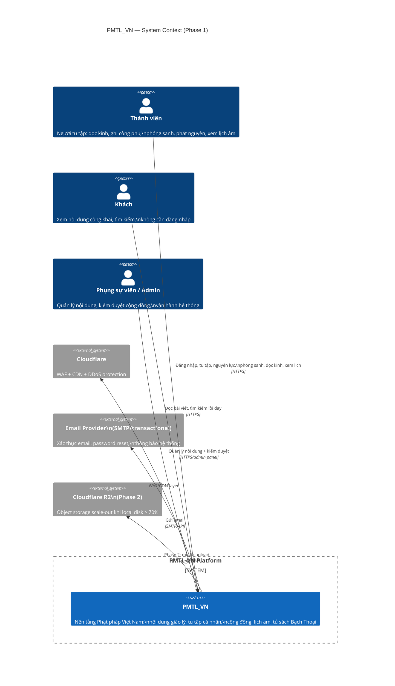
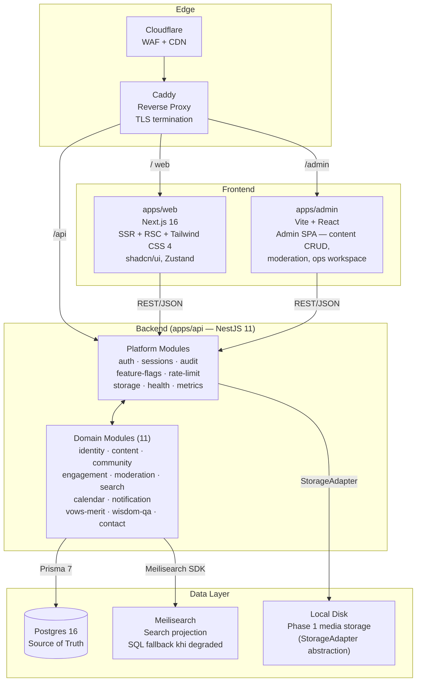
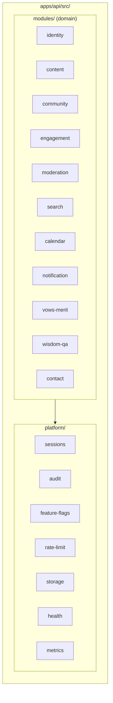

# C4 System Context — PMTL_VN

> **Authority**: overview/orientation only. Owner docs (DECISIONS.md, ARCHITECTURE_AT_A_GLANCE.md) thắng nếu có xung đột.
> **Last updated**: 2026-03-27

---

## Level 1 — System Context

---

## Level 2 — Container View (Phase 1 baseline)

---

## Level 3 — Key Component: apps/api module structure

---

## Phase gate quick reference

| Component | Phase 1 status | Trigger to activate |
|---|---|---|
| `apps/web + apps/api + apps/admin` | **launch target** | N/A |
| `Postgres + Caddy` | **launch target** | N/A |
| `Meilisearch` | **launch active** (Search-first) | SQL fallback là contingency |
| `audit_logs + feature_flags + rate_limit` | **required before launch** | — |
| `Valkey` | planned | rate_limit_records p95 > 100ms sustained 15m |
| `BullMQ + apps/worker` | planned | request > 2s OR retry unacceptable |
| `outbox_events` | planned | side effect failure cost > complexity |
| `PgBouncer` | planned | db_connection_count > 80% max |
| `Prometheus/Grafana` | planned | team shared visibility need |
| `OpenTelemetry` | planned | cross-service latency diagnosis |
| `Cloudflare R2` | planned | local disk > 70% OR restore drift > 5% |
| `pgvector` | **explicit exclusion** | See PGVECTOR_DECISION.md |

> Full owner: `design/04-execution-overlay/repo/IMPLEMENTATION_MAPPING.md`
