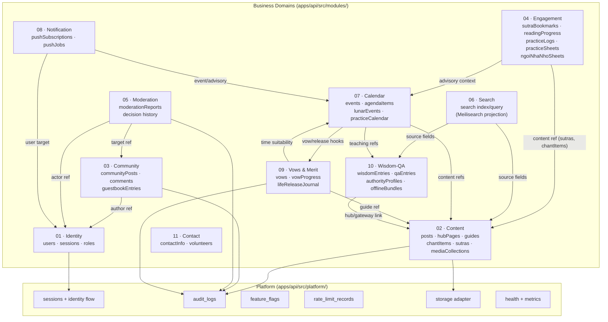
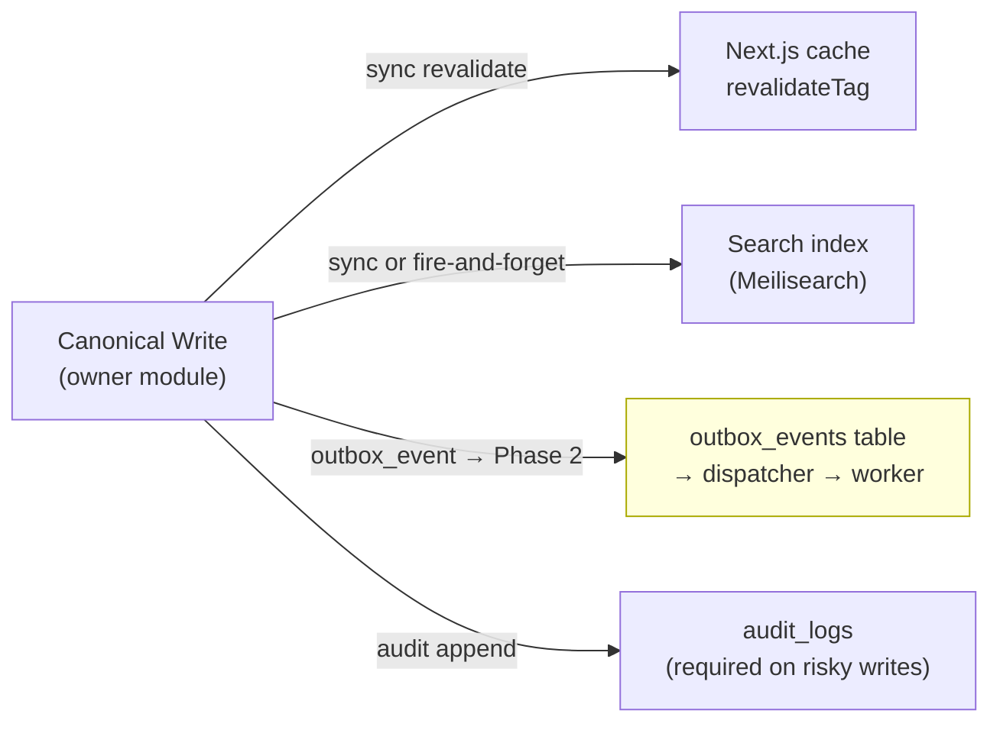

# Domain Interaction Map — PMTL_VN

> **Authority**: orientation/visual only. Owner docs trong `design/03-domains/<domain>/` thắng nếu có xung đột.
> **Rule**: mỗi domain chỉ có một chủ sở hữu dữ liệu thật. Cross-domain chỉ được đọc ref hoặc nhận derived package.
> **Last updated**: 2026-03-27

---

## 11 Domains + ownership boundary

---

## Data ownership: what each domain OWNS vs MUST NOT hold

| Domain | Owns (source of truth) | Must NOT self-hold |
|---|---|---|
| **Identity** | `users`, `sessions`, role/block state, provider linkage | community profile, notification cache source |
| **Content** | `posts`, `hubPages`, `beginnerGuides`, `downloads`, `chantItems`, `chantPlans`, `sutras`, `sutraVolumes`, `sutraChapters`, `sutraGlossary`, `categories`, `tags`, `mediaCollections` | bookmark, reading progress, practice sheets |
| **Community** | `communityPosts`, `communityComments`, `postComments`, `guestbookEntries` | report lifecycle canonical |
| **Engagement** | `sutraBookmarks`, `sutraReadingProgress`, `chantPreferences`, `practiceLogs`, `practiceSheets`, `ngoiNhaNhoSheets` | kinh văn gốc, guide gốc, FAQ gốc |
| **Moderation** | `moderationReports`, decision history | bài/comment gốc |
| **Search** | search query contract, index/status | publish status canonical, moderation status canonical |
| **Calendar** | `events`, `eventAgendaItems`, `eventSpeakers`, `eventCtas`, `lunarEvents`, `lunarEventOverrides`, `practiceCalendarReadModel` | full discourse text, ritual truth gốc |
| **Notification** | `pushSubscriptions`, `pushJobs`, reminder preferences | inbox canonical, source data của event/bài viết |
| **Vows & Merit** | `vows`, `vowProgressEntries`, `lifeReleaseJournal` | guide canonical, ritual script canonical |
| **Wisdom-QA** | `wisdomEntries`, `qaEntries`, `authorityProfiles`, audiobook metadata, offline bundle metadata, source provenance | beginner guide, hub page canonical |
| **Contact** | `contactInfo`, `volunteers` | form submissions, community profile, auth user store |

---

## Side effect taxonomy (when a write triggers downstream)

**Phase 1 rule**: side effects dùng sync hoặc fire-and-forget có `log intent + log outcome + recovery path`.
Outbox-driven pattern chỉ activate khi trigger đủ mạnh (xem `DECISIONS.md` section 3).

---

## Module interaction anti-patterns (common mistakes)

| Anti-pattern | Why it's wrong | Correct approach |
|---|---|---|
| Content giữ `sutraReadingProgress` | Progress là self-owned của user, không phải canonical content | Engagement giữ, đọc content ref |
| Community tự giữ full report lifecycle | Report canonical thuộc Moderation | Community chỉ giữ `target ref`, Moderation ghi decision |
| Search làm source of truth | Search chỉ là projection | Source thật ở Content hoặc Wisdom-QA |
| Calendar chép nguyên kinh văn vào advisory | Calendar chỉ compose, không own text | Calendar compose ref → text gốc ở Wisdom-QA |
| Admin tự sửa Engagement/Vows-Merit của member | Self-owned, cross-user write bị chặn | Phải có assisted-entry canon (xem `ASSISTED_ENTRY_WORKFLOW.md`) |
| `pushJobs` coi là inbox canonical | pushJobs là "phiếu công việc gửi" | Inbox canonical không tồn tại trong phase 1 |

> Owner doc cho từng domain: `design/03-domains/<domain>/CONTRACTS.md`
