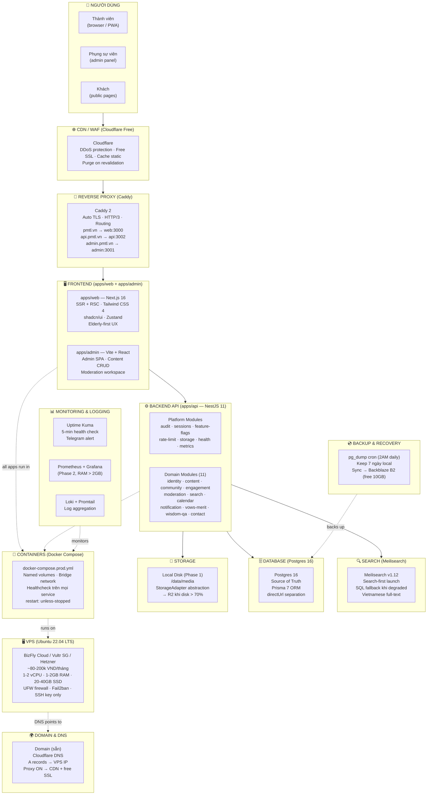
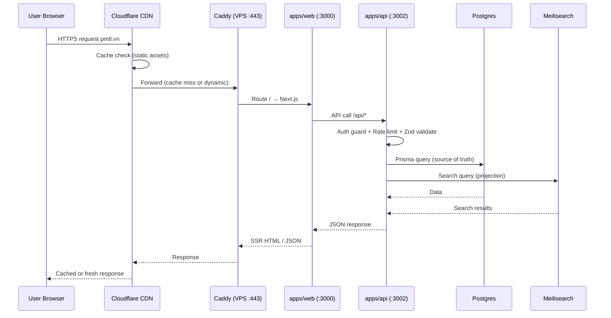
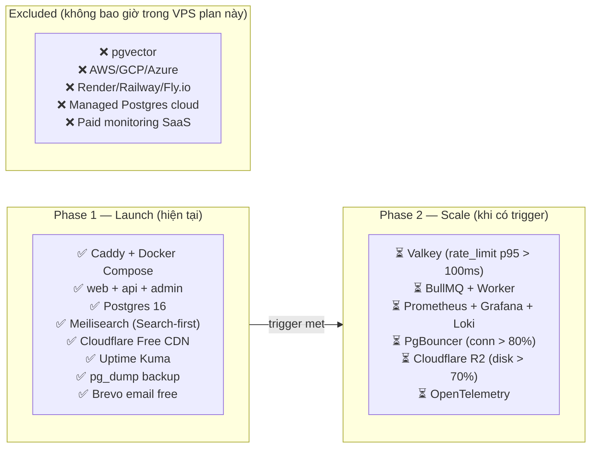

# VPS Full Stack — Layer Diagram

Visual này map toàn bộ stack PMTL_VN lên mô hình "cylinder tầng" cho VPS self-host.
Đọc từ dưới lên: hạ tầng → runtime → ứng dụng → người dùng.

---

## Full Stack Cylinder — VPS Self-Host

---

## Luồng request từ user đến database

---

## Phase gate overlay

---

## Chi phí theo từng tầng

| Tầng | Tool | Chi phí |
|---|---|---|
| CDN/WAF | Cloudflare Free | **$0** |
| Reverse Proxy | Caddy (open source) | **$0** |
| SSL Certificate | Let's Encrypt / Cloudflare | **$0** |
| Frontend | Next.js (open source) | **$0** |
| Backend | NestJS (open source) | **$0** |
| Database | Postgres (open source) | **$0** |
| Search | Meilisearch (open source) | **$0** |
| Containers | Docker (open source) | **$0** |
| Monitoring | Uptime Kuma (open source) | **$0** |
| Backup storage | Backblaze B2 / R2 10GB | **$0** |
| Email | Brevo 300/ngày | **$0** |
| CI/CD | GitHub Actions | **$0** |
| **VPS** | BizFly / Vultr / Hetzner | **~100-200k VND/tháng** |
| **Domain** | Sẵn | **$0** |
| **TỔNG** | | **~100-200k VND/tháng** |
